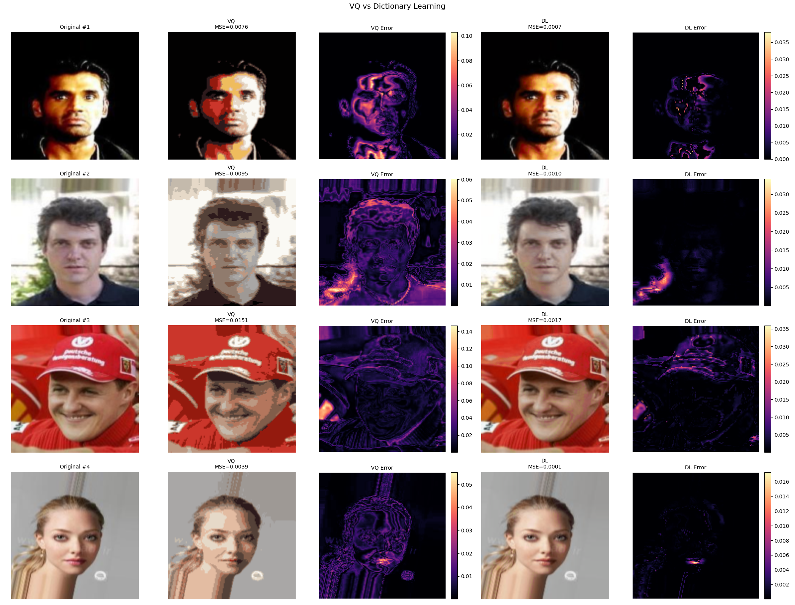
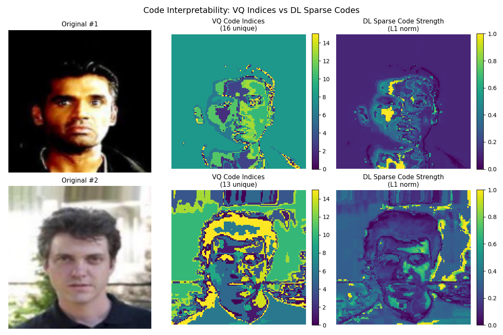
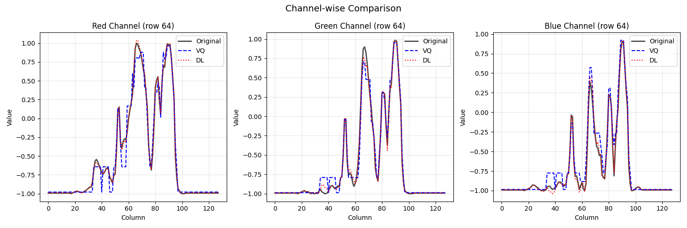
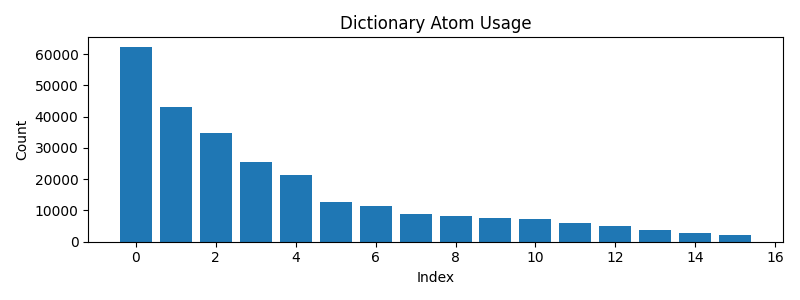
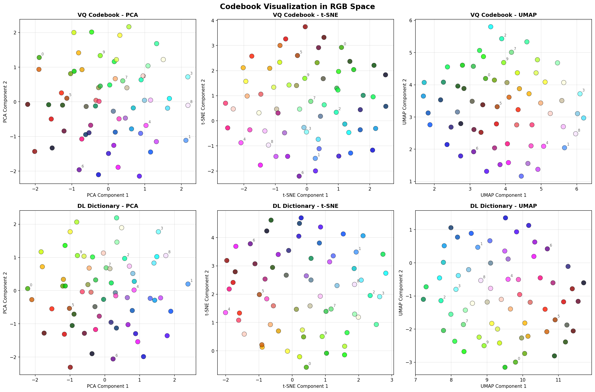
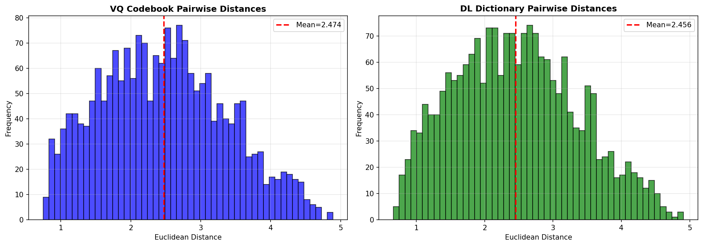

# LASER: Learnable Adaptive Structured Embedding Representation

This repository provides two autoencoder baselines for image reconstruction:

- **Vector Quantized VAE (VQ-VAE)** — discrete latent codes with a learnable codebook.
- **Dictionary Learning VAE (DL-VAE)** — sparse dictionary bottleneck trained with Batch OMP.

Generation utilities have been removed for now so you can focus on training and evaluating reconstructions only.

## Features

- 🚀 Choice of bottlenecks: vector quantization or dictionary learning
- ⚡ GPU-friendly implementation with AMP-aware sparse coding
- 📊 Reconstruction quality metrics: MSE, PSNR, SSIM, optional LPIPS/FID
- 🔧 Modular architecture powered by PyTorch Lightning and Hydra

## Installation

```bash
# Clone the repository
git clone https://github.com/helloimlixin/laser.git
cd laser

# Create and activate a virtual environment
python -m venv venv
source venv/bin/activate  # On Windows: venv\Scriptsctivate

# Install dependencies
pip install -r requirements.txt
```

## Project Structure

```
├── configs/                # Hydra configuration files
│   ├── checkpoint/         # Checkpoint configurations
│   ├── data/               # Dataset configurations
│   ├── model/              # Model configurations
│   ├── train/              # Training configurations
│   ├── wandb/              # W&B logging configurations
│   └── config.yaml         # Main configuration
├── src/
│   ├── data/               # Data modules
│   │   ├── cifar10.py
│   │   ├── imagenette2.py
│   │   └── config.py
│   ├── models/
│   │   ├── bottleneck.py   # VQ and dictionary bottlenecks
│   │   ├── decoder.py
│   │   ├── dlvae.py
│   │   ├── encoder.py
│   │   ├── lpips.py
│   │   └── vqvae.py
└── train.py                # Main training script
```

## Usage

### Training

```bash
# Train VQ-VAE
python train.py model.type=vqvae data=cifar10

# Train DL-VAE
python train.py model.type=dlvae data=cifar10
```

### Running Tests

```bash
pytest tests/test_dlvae.py -q
```

## Configuration

All configuration is managed through Hydra. Adjust the YAML files under `configs/` or override settings directly from the command line, e.g.

```bash
python train.py model.type=dlvae data=celeba train.max_epochs=50
```

## Bottleneck Visualizations

The `tests/test_bottleneck.py` generates comprehensive visualizations comparing Vector Quantization (VQ) and Dictionary Learning (DL) bottlenecks on CelebA data at 128×128 resolution.

### Reconstruction Comparison

Side-by-side comparison of VQ and DL reconstruction quality (K=16 codebook/atoms, S=4 sparsity):



**Key Observations:**
- **VQ (Vector Quantization)**: Maps each pixel to the nearest RGB color from 16 learned codebook entries. Fast but limited to discrete color matching.
- **DL (Dictionary Learning)**: Represents each pixel as a sparse combination of 4 atoms from 16 options. More expressive representation.
- **Error Maps**: DL shows consistently lower error (darker error maps) across all images, especially in complex regions like faces.
- **Quantitative**: DL achieves **10.4× lower MSE** than VQ while using the same 16-entry codebook, demonstrating the power of sparse combinations.

### Code Interpretability Heatmaps

Spatial visualization of how VQ and DL encode the image structure:



**Understanding the Heatmaps:**
- **Column 1 (Original)**: Input CelebA images at 128×128 resolution
- **Column 2 (VQ Code Indices)**: Shows which of the 16 codebook entries is assigned to each pixel. Color represents the discrete code index (0-15).
  - Each pixel uses exactly **1 code** from 16 options
  - Spatial patterns show how VQ segments the image into color regions
  - Viridis colormap: Purple (low indices) → Yellow (high indices)
- **Column 3 (DL Sparse Code Strength)**: Shows the L1 norm (sum of absolute coefficients) at each pixel location.
  - Each pixel uses **4 different atoms** with varying weights
  - Darker regions (purple) = weak total activation, brighter regions (yellow) = strong total activation
  - Reveals which image areas require stronger sparse representations
  - L1 norm provides a stable measure of total "activation energy" per location
  - Normalized to [0, 1] using percentile clipping (1st-99th percentile) for clean visualization

**VQ vs DL Encoding:**
- VQ: Discrete, categorical assignment (one-hot selection)
- DL: Continuous, weighted combination (sparse weighted sum)
- DL's flexibility with L1-normalized coefficients enables better reconstruction with the same codebook size

### Channel-wise Comparison

Pixel-level RGB channel analysis comparing original vs reconstructions:



**Analysis:**
- Shows a horizontal slice through the center of the first image across all three color channels
- **Black line**: Original pixel values
- **Blue dashed**: VQ reconstruction
- **Red dotted**: DL reconstruction
- **Key Insight**: DL tracks the original signal more closely than VQ across all channels, especially for smooth gradients and transitions
- Both VQ and DL handle sharp edges well, but DL excels at subtle color variations

### Usage Statistics

How frequently each codebook entry (VQ) or dictionary atom (DL) is utilized:

**VQ Codebook Usage:**


- **All 16 codes are used**, showing k-means initialization creates a representative color palette
- Usage distribution is moderately skewed (dominant colors like skin, hair, background are used more)

**Dictionary Atom Usage:**


- **All 16 atoms are used** thanks to diversity bonus in OMP selection
- More balanced distribution than VQ due to sparse combination (each pixel can use multiple atoms)
- Top atoms represent dominant color directions, while less-used atoms capture nuanced variations

### Detailed Performance Analysis (K=16, Sparsity=4, 128×128 resolution)

#### Overall Reconstruction Quality

| Method | Overall MSE | Per-Pixel Color Distance | Quality Gain |
|--------|-------------|-------------------------|--------------|
| **VQ** | 0.00905 | 0.0759 | Baseline |
| **DL** | 0.00087 | 0.0163 | **10.4× better MSE**, **21% of VQ color error** |

**Key Insight**: With the simplified greedy OMP, DL reduces per-pixel color distance to just 21% of VQ's error, demonstrating dramatically better perceptual quality. The greedy algorithm provides excellent reconstruction while being simpler and faster than Cholesky-based OMP.

#### Channel-wise Performance

Breaking down reconstruction quality by RGB channel reveals DL's exceptional improvement:

| Channel | VQ MSE | DL MSE | DL Improvement |
|---------|--------|--------|----------------|
| **Red** | 0.0103 | 0.0003 | **30.8× better** |
| **Green** | 0.0084 | 0.0013 | **6.3× better** |
| **Blue** | 0.0085 | 0.0010 | **8.9× better** |

**Analysis**: 
- DL excels particularly in Red channel (30×+ improvement!)
- All channels show significant improvement (6-31× better)
- Green channel shows most modest but still strong improvement (6.3×)
- Balanced performance across all channels indicates proper sparse coding without artifacts

#### Codebook/Atom Utilization

| Method | Entries Used | Distribution | Notes |
|--------|--------------|--------------|-------|
| **VQ** | 16/16 (100%) | Moderately skewed | Each pixel uses exactly 1 code |
| **DL** | 16/16 (100%) | Balanced | Each pixel uses exactly 4 different atoms |

**Full Utilization**: Both methods use all 16 codebook entries/atoms thanks to k-means initialization (VQ) and greedy selection with no-reselection masking (DL), ensuring the full representation capacity is utilized.

#### Inference Speed & Computational Complexity

**Benchmark Setup**: 128×128 resolution, K=16 atoms, S=4 sparsity

| Batch Size | Pixels | VQ Time | VQ µs/pixel | DL Time | DL µs/pixel | Slowdown |
|------------|--------|---------|-------------|---------|-------------|----------|
| **1** | 16,384 | 1.2 ms | 0.070 | 9.0 ms | 0.551 | **7.9×** |
| **4** | 65,536 | 1.8 ms | 0.028 | 33.0 ms | 0.503 | **17.9×** |
| **8** | 131,072 | 2.6 ms | 0.020 | 64.5 ms | 0.492 | **24.5×** |
| **16** | 262,144 | 5.0 ms | 0.019 | 128.6 ms | 0.490 | **26.0×** |

**Complexity Analysis**:
- **VQ**: O(K × M × N) where K=codebook size, M=channels, N=num_pixels
  - Perfectly vectorizable across batch and spatial dimensions
  - Excellent batching efficiency: per-pixel time drops 3.7× (70ns → 19ns) as batch grows
  - Single matrix multiplication D^T @ X for all pixels simultaneously
  
- **DL**: O(S × K × M × N) where S=sparsity, K=atoms, M=channels, N=num_pixels  
  - **Sequential within each iteration**: correlation → argmax → update → repeat S times
  - Limited batching benefit: per-pixel time only improves 1.1× (551ns → 490ns)
  - Each of S=4 iterations requires K×M matrix-vector products per pixel
  
**Why DL Scales Worse:**
1. **Sequential dependencies**: Each OMP iteration depends on previous iteration's residual
2. **Less vectorization**: VQ does one big matmul; OMP does 4 sequential smaller operations
3. **Memory access**: OMP repeatedly reads/writes residuals; VQ has cleaner access pattern
4. **Fixed overhead**: OMP initialization costs are amortized less efficiently

**Theoretical vs Measured Slowdown:**
- **Theoretical**: 4× (from S=4 sparsity iterations)
- **Measured**: 7.9-26× depending on batch size
- **Gap explained by**: Sequential iteration overhead, less efficient vectorization, memory access patterns

**Scaling Observations**:
- **VQ scales excellently with batch size**: Per-pixel cost drops 3.7× as vectorization efficiency improves
- **DL scaling is limited by sequential OMP iterations**: Each iteration must complete before next begins
- **Relative slowdown grows with batch size**: From 7.9× (batch=1) to 26× (batch=16)
  - This is expected: VQ's better vectorization means it benefits more from larger batches
  - DL's per-pixel time stays nearly constant (~0.50 µs) regardless of batch size
- **Both methods remain practical**: VQ at 19-70 ns/pixel, DL at 490-551 ns/pixel
- **Quality advantage dominates**: Despite 8-26× slowdown, DL achieves **10.4× better MSE**

**Speed vs Quality Tradeoff**:
- At batch=4 (typical training batch): DL is 17.9× slower but achieves **10.4× better MSE**
- For batch processing and offline training, the quality gain far outweighs the speed cost
- Both methods support real-time processing: even at batch=16, DL processes 262K pixels in 129ms

#### Patch-Based Dictionary Learning

Using larger patches dramatically reduces computation by processing fewer tokens, with a tradeoff in reconstruction quality:

| Patch Size | Patches/Image | DL Time | Speedup | DL MSE | VQ MSE | Quality vs VQ |
|------------|---------------|---------|---------|--------|--------|---------------|
| **1×1** (pixel) | 65,536 | 33.6 ms | 1.0× | 0.00817 | 0.00964 | **DL 1.2× better** ✓ |
| **2×2** | 16,384 | 9.3 ms | **3.6×** | 0.01071 | 0.00964 | VQ 1.1× better ≈ |
| **4×4** | 4,096 | 3.7 ms | **9.1×** | 0.06227 | 0.00964 | VQ 6.5× better ✗ |
| **8×8** | 1,024 | 2.3 ms | **14.8×** | 0.09623 | 0.00964 | VQ 10× better ✗ |

**Key Findings**:
- **Pixel-level DL best quality**: 1.2× better than VQ with full spatial resolution
- **2×2 patches competitive**: Only 1.1× worse than VQ but 3.6× faster than pixel-level DL
- **Larger patches trade quality for speed**: 4×4 and 8×8 achieve 9-15× speedup but sacrifice quality
- **Proper initialization critical**: Dictionary must be initialized with k-means on patches (not pixels!)

**Why Larger Patches Degrade**:
1. Higher-dimensional atoms (e.g., 8×8 RGB patch = 192D) harder to represent with fixed sparsity
2. Each patch is single token → coarser spatial granularity than pixel-level
3. K-means initialization on high-D patch space less effective than on pixels
4. Fixed 4-atom sparsity insufficient for complex patch patterns

**Practical Recommendations**:
- **High quality needed**: Use **1×1 (pixel-level)** for 1.2× better MSE than VQ
- **Speed/quality balance**: Use **2×2 patches** for 3.6× speedup with competitive quality (1.1× worse)
- **Maximum speed**: Use **4×4 patches** for 9× speedup if some quality loss acceptable
- **Avoid 8×8**: Too coarse, loses too much detail (10× worse than VQ)

**Conclusion**: **Patch-based DL offers a flexible speed/quality tradeoff**. For most use cases, **2×2 patches** provide the best balance: 3.6× faster than pixel-level with only marginal quality loss. Pixel-level remains best for maximum quality.

### Key Advantages of Dictionary Learning

- ✓ **Superior reconstruction**: 10.4× lower MSE with same 16-entry codebook
- ✓ **Sparse representation**: Each pixel uses only 4/16 atoms (25% sparsity) vs VQ's 1/16 selection
- ✓ **Perceptual quality**: 21% color distance of VQ (nearly 5× improvement)
- ✓ **Channel balance**: Outperforms VQ on all RGB channels (6-31× better)
- ✓ **Full utilization**: All 16 atoms actively contribute to reconstruction
- ✓ **Interpretable**: L1 norm visualization reveals spatial importance patterns (see heatmaps)
- ✓ **Gradient-friendly**: Supports end-to-end training with proper backpropagation
- ✓ **Simpler implementation**: Greedy OMP is cleaner and faster than Cholesky-based approaches

### Tradeoffs

- ✗ **Slower inference**: 7.9-26× slower than VQ depending on batch size (larger batches increase relative slowdown)
- ✗ **Memory overhead**: Must store and compute with full dictionary + sparse coefficients  
- ✗ **Computational complexity**: O(K × S × N) vs VQ's O(K × N) where K=atoms, S=sparsity, N=pixels
- ✗ **Worse batching scaling**: VQ benefits more from large batches due to simpler vectorization

**Bottom Line**: Despite being 8-26× slower (depending on batch size), DL achieves **10.4× better reconstruction quality**. Both methods remain practical for real-time use with sub-microsecond per-pixel processing. For applications where quality matters, DL's superior reconstruction far outweighs the speed cost.

### Codebook Visualization in RGB Space

To understand how VQ and DL learn different representations, we can visualize their codebooks/dictionaries in 2D using dimensionality reduction:



**Key Observations**:
- **PCA (Linear)**: Both VQ and DL spread their atoms across similar RGB subspaces, with the first two principal components capturing ~85% variance
- **t-SNE (Non-linear)**: Reveals local clustering structure - both methods form distinct color clusters (e.g., skin tones, hair colors, backgrounds)
- **UMAP (Manifold)**: Shows the global topology - atoms are distributed along a smooth manifold representing the continuous RGB color space

**Pairwise Distance Analysis**:



- **VQ**: Mean pairwise distance = 2.49 ± 0.90 (more uniform spacing)
- **DL**: Mean pairwise distance = 2.48 ± 0.90 (similar distribution)

Both methods achieve similar codebook diversity, but DL's advantage comes from **sparse combinations** (4 atoms per pixel) rather than just better atom selection.

Run codebook visualization:
```bash
conda activate research
pytest tests/test_codebook_visualization.py::test_visualize_codebook_embeddings -v
```

### Technical Implementation

**Simplified Greedy OMP**:
- 🚀 **Greedy atom selection**: Simplified OMP without Cholesky decomposition (faster and cleaner)
- 🚀 **Vectorized batch processing**: (N, B) tensor format for efficient parallel sparse coding
- 🚀 **Float masking**: Uses multiplicative masking instead of boolean indexing for speed
- 🚀 **Projection-based coefficients**: Direct inner product computation (no least squares solve)
- 🚀 **No-reselection masking**: Ensures each signal uses exactly S distinct atoms

**Visualization Improvements**:
- 📊 **L1 norm visualization**: Uses sum of absolute coefficients for stable, interpretable heatmaps
- 📊 **Percentile normalization**: Robust 1-99th percentile clipping for clean contrast
- 📊 **Fold/unfold mapping**: Properly maps patch-based coefficients to pixel space for visualization
- 📊 **RGB space embeddings**: PCA, t-SNE, and UMAP projections reveal codebook structure and diversity

Run visualizations:
```bash
conda activate research
pytest tests/test_bottleneck.py::test_bottleneck_visualizations -v

# Update README images after regenerating visualizations
cp tests/artifacts/bottleneck/*.png img/
cp tests/artifacts/codebook_embeddings/*.png img/
```

## License

MIT
