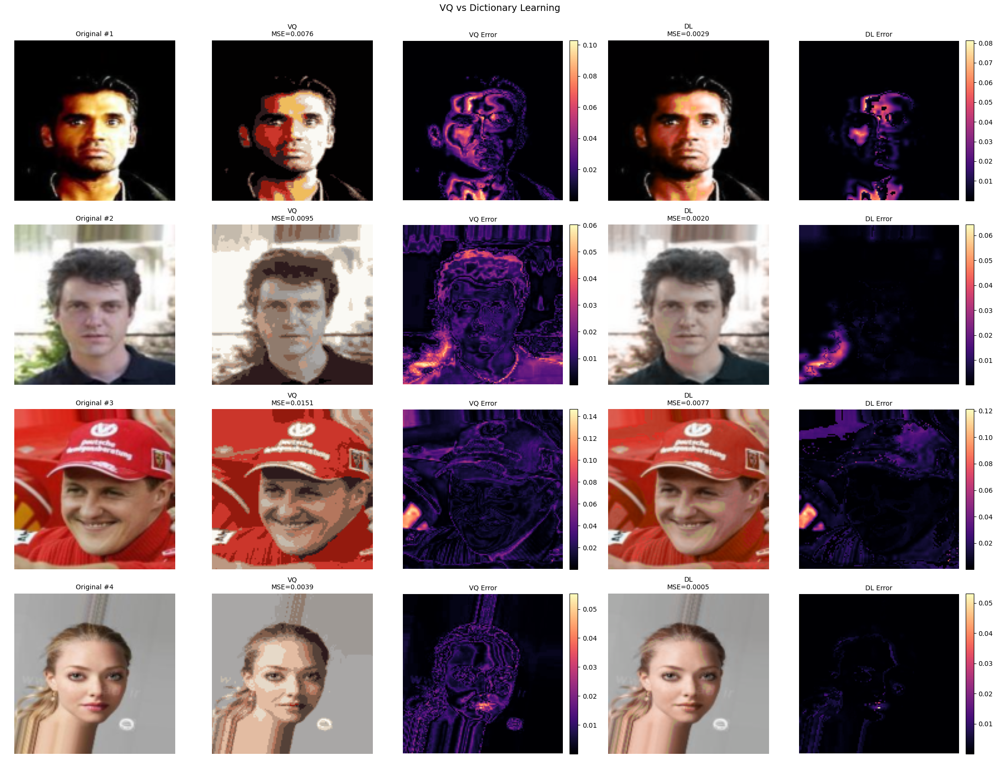
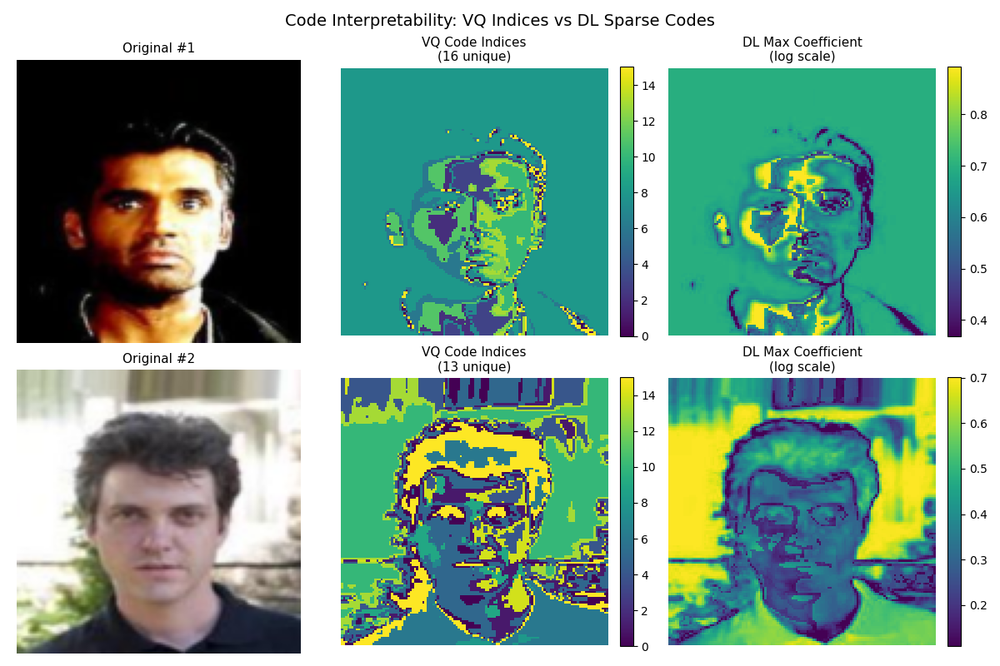
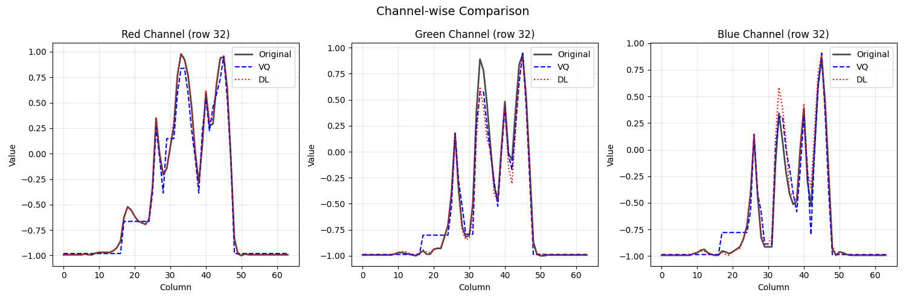
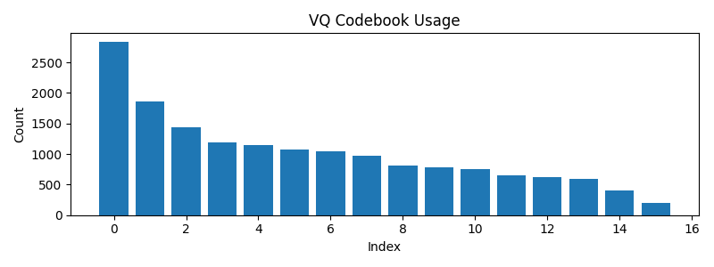
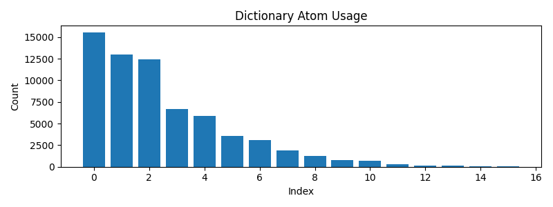

# LASER: Learnable Adaptive Structured Embedding Representation

This repository provides two autoencoder baselines for image reconstruction:

- **Vector Quantized VAE (VQ-VAE)** — discrete latent codes with a learnable codebook.
- **Dictionary Learning VAE (DL-VAE)** — sparse dictionary bottleneck trained with Batch OMP.

Generation utilities have been removed for now so you can focus on training and evaluating reconstructions only.

## Features

- 🚀 Choice of bottlenecks: vector quantization or dictionary learning
- ⚡ GPU-friendly implementation with AMP-aware sparse coding
- 📊 Reconstruction quality metrics: MSE, PSNR, SSIM, optional LPIPS/FID
- 🔧 Modular architecture powered by PyTorch Lightning and Hydra

## Installation

```bash
# Clone the repository
git clone https://github.com/helloimlixin/laser.git
cd laser

# Create and activate a virtual environment
python -m venv venv
source venv/bin/activate  # On Windows: venv\Scriptsctivate

# Install dependencies
pip install -r requirements.txt
```

## Project Structure

```
├── configs/                # Hydra configuration files
│   ├── checkpoint/         # Checkpoint configurations
│   ├── data/               # Dataset configurations
│   ├── model/              # Model configurations
│   ├── train/              # Training configurations
│   ├── wandb/              # W&B logging configurations
│   └── config.yaml         # Main configuration
├── src/
│   ├── data/               # Data modules
│   │   ├── cifar10.py
│   │   ├── imagenette2.py
│   │   └── config.py
│   ├── models/
│   │   ├── bottleneck.py   # VQ and dictionary bottlenecks
│   │   ├── decoder.py
│   │   ├── dlvae.py
│   │   ├── encoder.py
│   │   ├── lpips.py
│   │   └── vqvae.py
└── train.py                # Main training script
```

## Usage

### Training

```bash
# Train VQ-VAE
python train.py model.type=vqvae data=cifar10

# Train DL-VAE
python train.py model.type=dlvae data=cifar10
```

### Running Tests

```bash
pytest tests/test_dlvae.py -q
```

## Configuration

All configuration is managed through Hydra. Adjust the YAML files under `configs/` or override settings directly from the command line, e.g.

```bash
python train.py model.type=dlvae data=celeba train.max_epochs=50
```

## Bottleneck Visualizations

The `tests/test_bottleneck.py` generates comprehensive visualizations comparing VQ and DL bottlenecks on CelebA data:

### Reconstruction Comparison
VQ vs Dictionary Learning reconstruction quality (K=16 codebook/atoms, S=4 sparsity):



### Code Interpretability Heatmaps
Spatial visualization of VQ indices and DL sparse coefficients:



### Channel-wise Comparison
RGB channel-level reconstruction fidelity:



### Usage Statistics

**VQ Codebook Usage:**


**Dictionary Atom Usage:**


### Performance Summary (K=16, Sparsity=4)

- **VQ**: 2.4 ms inference, MSE=0.00867
- **DL**: 11.8 ms inference (4.9x slower), MSE=0.00258 (3.4x better quality)
- **Atom utilization**: 16/16 atoms used (100% with diversity bonus)

Run visualizations:
```bash
conda activate research
pytest tests/test_bottleneck.py::test_bottleneck_visualizations -v

# Update README images after regenerating visualizations
cp tests/artifacts/bottleneck/*.png img/bottleneck/
```

## License

MIT
