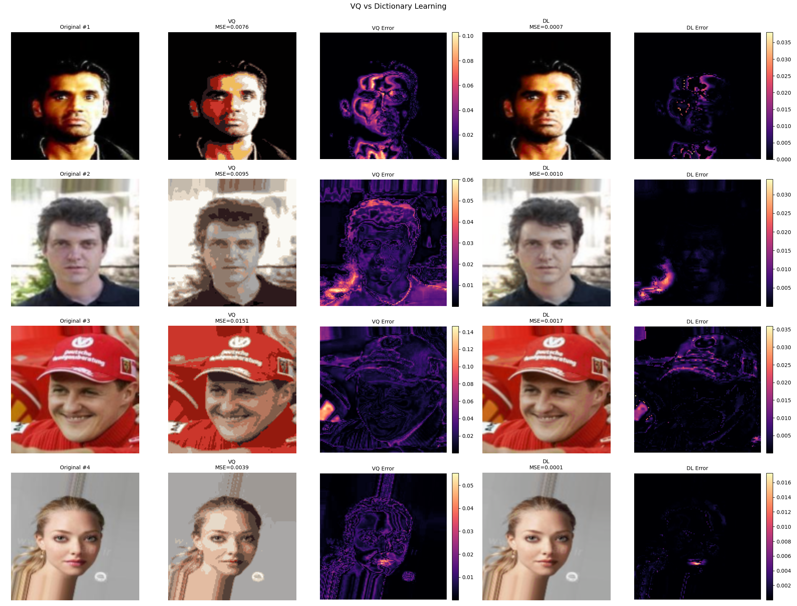
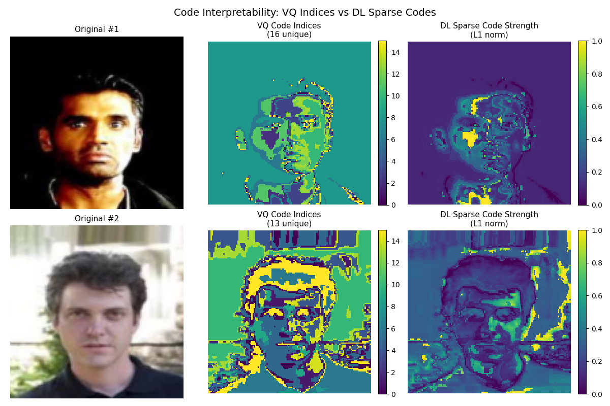
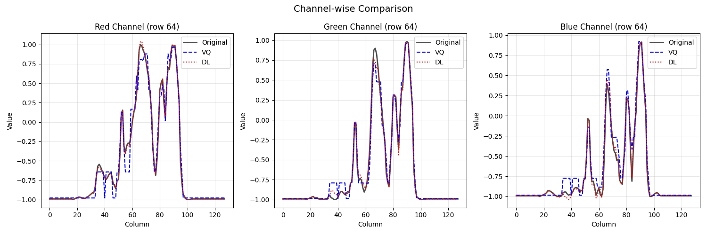
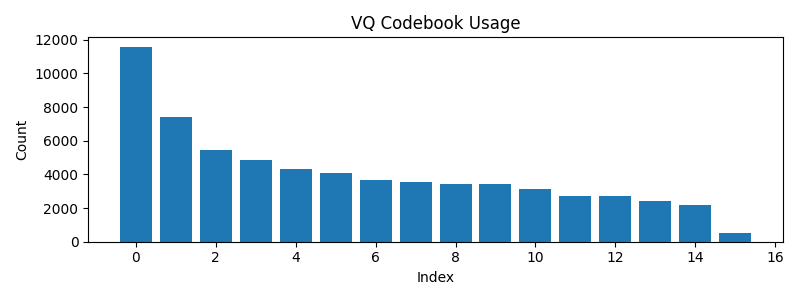
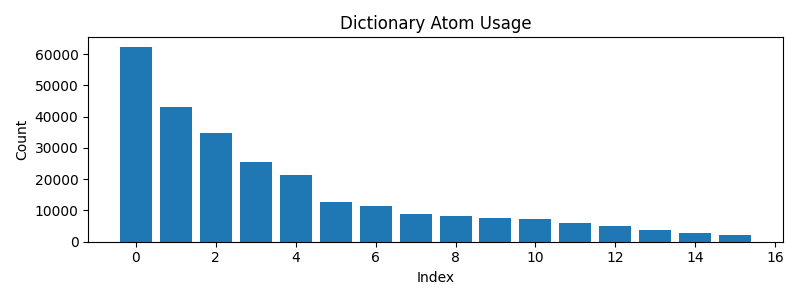
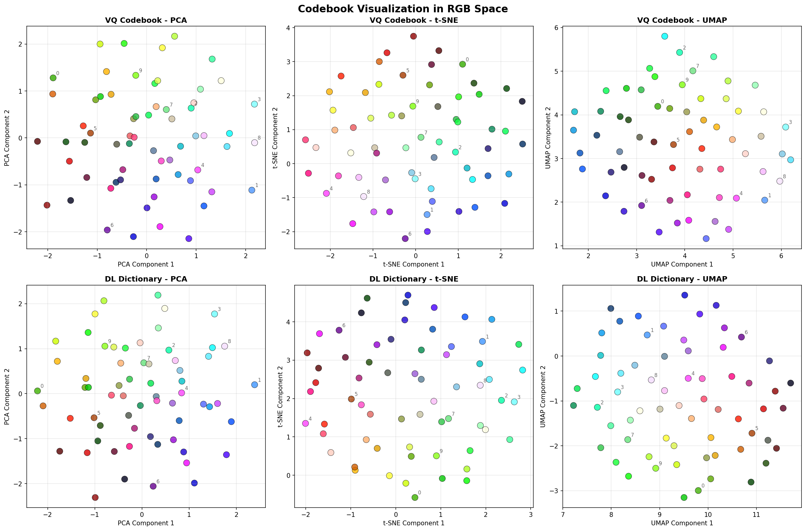
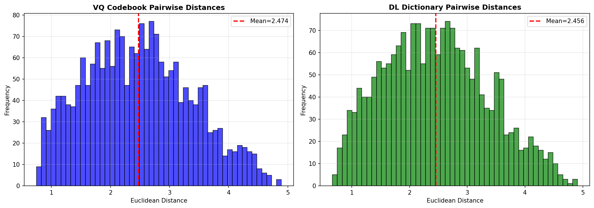

# LASER: Learnable Adaptive Structured Embedding Representation

This repository provides autoencoder models with dictionary learning for image reconstruction:

- **LASER (Learnable Adaptive Structured Embedding Representation)** — Sparse dictionary autoencoder with OMP-based latent coding, a VQGAN/DDPM-style stage-1 backbone, and maintained stage-2 sparse-token priors.
- **VQ-VAE (Vector Quantized VAE)** — Baseline model with discrete latent codes and a learnable codebook.

## Features

- 🚀 OMP-based dictionary learning with configurable sparsity
- 🧠 VQGAN/DDPM-style ResNet+attention encoder/decoder for stage 1
- ⚡ GPU-friendly implementation with AMP-aware sparse coding
- 📊 Comprehensive metrics: MSE, PSNR, SSIM, LPIPS, FID
- 🔧 Modular architecture powered by PyTorch Lightning and Hydra
- 🎯 Maintained stage-2 priors for sparse token generation

## Installation

```bash
# Clone the repository
git clone https://github.com/helloimlixin/laser.git
cd laser

# Create and activate a virtual environment
python -m venv venv
source venv/bin/activate  # On Windows: venv\Scriptsctivate

# Install dependencies
pip install -r requirements.txt
```

## Project Structure

```
├── configs/                # Hydra configuration files
│   ├── checkpoint/         # Checkpoint configurations
│   ├── data/               # Dataset configurations (CIFAR-10, CelebA, Imagenette2)
│   ├── model/              # Model configurations (LASER, VQ-VAE)
│   ├── train/              # Training configurations
│   ├── wandb/              # W&B logging configurations
│   └── config.yaml         # Main configuration
├── src/
│   ├── data/               # Data modules
│   │   ├── cifar10.py
│   │   ├── celeba.py
│   │   ├── imagenette2.py
│   │   └── config.py
│   ├── models/
│   │   ├── bottleneck.py   # Dictionary learning and VQ bottlenecks
│   │   ├── decoder.py
│   │   ├── encoder.py
│   │   ├── laser.py        # LASER model
│   │   ├── vqvae.py        # VQ-VAE baseline
│   │   ├── lpips.py
│   └── visualizations/     # Visualization utilities
├── tests/                  # Unit tests
├── train.py                # Main training script
└── test.py                 # Testing script
```

## Usage

### Training

```bash
# Train LASER with OMP sparse coding
python train.py model=laser data=cifar10

# Train LASER on CelebA
python train.py model=laser data=celeba

# Train VQ-VAE baseline
python train.py model=vqvae data=cifar10

# Override config parameters
python train.py model=laser data=celeba train.max_epochs=50 model.sparsity_level=16
```

### Testing

```bash
# Run model tests
pytest tests/test_bottleneck.py -v
pytest tests/test_encoder.py -v
pytest tests/test_decoder.py -v

# Test LASER model
python test.py --checkpoint path/to/checkpoint.ckpt --dataset celeba
```

### Quick Smoke Test

Run a tiny end-to-end CelebA smoke test that:
- builds an 8192-image symlinked subset
- trains a tiny stage-1 LASER model
- saves a stage-1 input/reconstruction preview
- extracts a sparse token cache
- saves a token-cache decode preview
- trains a tiny stage-2 sparse prior on the full extracted train split
- generates a small sample sheet

```bash
python scripts/smoke_e2e.py
```

Useful overrides:

```bash
# Use a specific CelebA directory
python scripts/smoke_e2e.py --data-dir /path/to/celeba

# Rebuild outputs from scratch
python scripts/smoke_e2e.py --clean

# Compare against the non-patch bottleneck
python scripts/smoke_e2e.py --no-patch-based
```

The generated samples are still a smoke-test artifact, but the defaults now give stage-2 a bit more signal. In practice the most useful outputs are usually `stage1_recon_preview.png`, `token_cache_decode_preview.png`, and then `samples.png` in that order.

### Recommended GPU Commands

The commands below assume:
- two GPUs visible as `CUDA_VISIBLE_DEVICES=0,1`
- W&B logging enabled
- local CelebA images at `/home/xl598/Projects/data/celeba`

#### Dual-GPU Smoke Run

This is the maintained one-command pipeline for a quick end-to-end sanity run:
- builds a subset
- trains stage 1
- extracts the token cache
- trains stage 2
- generates samples

```bash
CUDA_VISIBLE_DEVICES=0,1 python3 scripts/smoke_e2e.py \
  --clean \
  --device auto \
  --train-accelerator gpu \
  --devices 2 \
  --subset-size 8192 \
  --image-size 128 \
  --num-embeddings 4096 \
  --sparsity-level 8 \
  --coeff-bins 256 \
  --stage1-batch-size 16 \
  --stage2-batch-size 16 \
  --stage1-epochs 2 \
  --stage2-epochs 2 \
  --stage2-sample-every-n-steps 200 \
  --stage2-sample-num-images 4 \
  --stage1-num-hiddens 128 \
  --stage1-embedding-dim 16 \
  --stage1-num-residual-blocks 2 \
  --stage1-num-residual-hiddens 32 \
  --stage2-d-model 128 \
  --stage2-n-heads 4 \
  --stage2-n-layers 4 \
  --stage2-d-ff 512 \
  --temperature 0.9 \
  --top-k 64
```

During stage-2 training, periodic samples are saved under:

```text
<output-root>/ar/samples/<run_name>/step_0000200.png
<output-root>/ar/samples/<run_name>/step_0000200_autocontrast.png
```

Useful smoke outputs:
- `stage1_recon_preview.png`
- `stage1_recon_preview_autocontrast.png`
- `token_cache_decode_preview.png`
- `token_cache_decode_preview_autocontrast.png`
- `samples.png`
- `samples_autocontrast.png`

Interpretation:
- If `stage1_recon_preview` looks bad, stage 1 is still too weak.
- If `token_cache_decode_preview` looks okay but `samples` looks bad, stage 2 is the bottleneck.

#### Full-Dataset Stage 1

For the real full dataset, prefer the maintained entrypoints directly instead of `scripts/smoke_e2e.py`.

```bash
CUDA_VISIBLE_DEVICES=0,1 python3 train.py \
  model=laser \
  data=celeba \
  data.data_dir=/home/xl598/Projects/data/celeba \
  data.image_size=128 \
  data.batch_size=16 \
  data.num_workers=8 \
  train.accelerator=gpu \
  train.devices=2 \
  train.strategy=auto \
  train.max_epochs=2 \
  wandb.project=laser \
  wandb.name=celeba_full_stage1 \
  model.num_embeddings=4096 \
  model.sparsity_level=8 \
  model.num_hiddens=128 \
  model.embedding_dim=16 \
  model.num_residual_blocks=2 \
  model.num_residual_hiddens=32 \
  model.patch_based=true \
  model.patch_size=4 \
  model.patch_stride=2 \
  model.patch_reconstruction=hann \
  model.compute_fid=false \
  model.log_images_every_n_steps=0
```

#### Full-Dataset Token Cache Extraction

```bash
python3 extract_token_cache.py \
  --dataset celeba \
  --data-dir /home/xl598/Projects/data/celeba \
  --split train \
  --batch-size 16 \
  --num-workers 8 \
  --image-size 128 \
  --device auto \
  --coeff-bins 256 \
  --coeff-max auto
```

#### Full-Dataset Stage 2

```bash
CUDA_VISIBLE_DEVICES=0,1 python3 train_s2.py \
  output_dir=outputs/ar \
  token_cache_path=null \
  data.num_workers=8 \
  ar.type=sparse_spatial_depth \
  ar.d_model=128 \
  ar.n_heads=4 \
  ar.n_layers=4 \
  ar.d_ff=512 \
  wandb.project=laser-ar \
  wandb.name=celeba_s2 \
  train_ar.batch_size=16 \
  train_ar.max_epochs=2 \
  train_ar.accelerator=gpu \
  train_ar.devices=2 \
  train_ar.sample_every_n_steps=200 \
  train_ar.sample_num_images=4
```

The maintained stage-2 path reads dataset and image metadata from the token cache.
`data.num_workers` still controls the cache loader, but `data.dataset` is only a legacy hint and is not used to pick CIFAR vs CelebA.

#### Generation

```bash
python3 sample_s2.py \
  --dev auto \
  -n 16 \
  -b 8
```

This will infer the latest maintained:
- stage-1 checkpoint
- stage-2 checkpoint
- token cache

`train_ar.py`, `sample_ar.py`, and `generate_ar.py` remain available as compatibility wrappers.
`gen_s2.py` is the short compatibility sampler that still writes `samples.pt`.

#### Local 2-GPU P4 Launcher

For the current `p4s4` experiments on a local machine, use [scripts/local_p4.sh](/scratch/xl598/Projects/laser/scripts/local_p4.sh). It wraps the maintained [run_p4s1.sh](/scratch/xl598/Projects/laser/scripts/run_p4s1.sh) and [run_p4s2.sh](/scratch/xl598/Projects/laser/scripts/run_p4s2.sh) path with conservative defaults for a 2-GPU RTX 4000 box.

```bash
# Fresh local run: stage 1, token cache, then stage 2.
DATA_DIR=/data/celebahq_packed_256 \
RUN_ROOT=$PWD/runs/local_p4 \
bash scripts/local_p4.sh
```

```bash
# Stage-2 only from an existing local run root.
MODE=s2 \
RUN_ROOT=$PWD/runs/local_p4 \
WIN_LIST=32,64 \
bash scripts/local_p4.sh
```

```bash
# Stage-2 only with explicit stage-1 refs.
MODE=s2 \
RUN_ROOT=$PWD/runs/local_p4 \
S1_CKPT=/path/to/last.ckpt \
CACHE_PT=/path/to/tok_q256.pt \
WIN_LIST=32 \
bash scripts/local_p4.sh
```

Default local settings are intentionally small: `S1_BSZ=1`, `S2_BSZ=1`, `S1_WORKERS=2`, `S2_WORKERS=2`, `PATCH=4`, `STRIDE=4`, `ATOMS=4096`, `K=16`, `BINS=256`, and `WIN_LIST=32`. Raise them only if your local VRAM and host RAM can handle it.

## Configuration

All configuration is managed through Hydra. Adjust the YAML files under `configs/` or override settings directly from the command line:

```bash
# Override specific parameters
python train.py model=laser data=celeba train.max_epochs=100 model.sparsity_level=8

# Tune sparse coding capacity
python train.py model=laser model.sparsity_level=10 model.num_embeddings=1024

# Switch to the legacy simple backbone
python train.py model=laser model.backbone=simple
```

## LASER: Maintained Model Architecture

This section describes the maintained `src/` training and sampling path:

- stage 1: [train.py](train.py)
- token extraction: [extract_token_cache.py](extract_token_cache.py)
- stage 2: [train_s2.py](train_s2.py)

Older exploratory code under `scratch/` may use different defaults. The section below is the authoritative description of the current maintained model.

### End-to-End Pipeline

```text
image x
  -> stage-1 encoder backbone
  -> latent feature map z_e
  -> sparse dictionary bottleneck
  -> sparse support + coefficients
  -> straight-through latent z_st
  -> stage-1 decoder backbone
  -> reconstruction x_hat

sparse support + coefficients
  -> token cache
  -> stage-2 sparse prior
  -> sampled sparse support + coefficients
  -> stage-1 bottleneck decoder
  -> stage-1 image decoder
  -> generated image
```

### Design Goals

- Use a stronger stage-1 image backbone than the older plain VQ-VAE-style CNN, so the autoencoder can model longer-range structure before sparse coding is applied.
- Keep the latent representation sparse and interpretable by reconstructing each latent site or latent patch from a small number of dictionary atoms.
- Separate representation learning from generative modeling: stage 1 learns a useful sparse latent space, and stage 2 learns a distribution over that sparse code space.
- Preserve compatibility across per-site and patch-based bottlenecks by storing explicit latent-shape metadata in the token cache.

### Stage 1: Sparse Dictionary Autoencoder

The maintained stage-1 model lives in [src/models/laser.py](src/models/laser.py). It is a LightningModule that wraps three pieces:

1. An image encoder.
2. A sparse dictionary bottleneck.
3. An image decoder.

The current default config in [configs/model/laser.yaml](configs/model/laser.yaml) uses:

```yaml
model:
  type: laser
  backbone: vqgan
  num_hiddens: 128
  num_downsamples: 2
  num_residual_blocks: 2
  num_residual_hiddens: 32
  max_ch_mult: 2
  decoder_extra_residual_layers: 1
  use_mid_attention: true
  attn_resolutions: []
  num_embeddings: 1024
  embedding_dim: 4
  sparsity_level: 8
  patch_based: true
  patch_size: 4
  patch_stride: 2
  patch_reconstruction: hann
```

At `128x128`, `num_downsamples=2` produces a `32x32` latent grid. With `num_hiddens=128` and `max_ch_mult=2`, the default channel schedule is effectively:

```text
128x128x3
  -> 128x128x128
  ->  64x64x128
  ->  64x64x256
  ->  32x32x256
  ->  32x32x4   (embedding_dim)
```

#### Encoder Backbone

The default `backbone: vqgan` reuses the maintained DDPM/VQGAN-style encoder from [src/models/rq_ae.py](src/models/rq_ae.py):

- `conv_in`: a `3x3` convolution lifts RGB into the base channel width.
- Resolution levels: each level applies `num_residual_blocks` ResNet blocks, optional self-attention at configured resolutions, and a learned downsample except at the last level.
- Middle block: `ResnetBlock -> AttnBlock -> ResnetBlock`.
- Output projection: `GroupNorm -> SiLU -> 3x3 conv` to `embedding_dim`.

Important details:

- `attn_resolutions: []` does **not** mean “no attention anywhere”. With `use_mid_attention: true`, the model still keeps a middle attention block at the coarsest latent resolution.
- This is the main mechanism used to inject longer-range spatial mixing into stage 1 without paying the cost of attention at every resolution.
- The older compatibility backbone still exists as `backbone: simple`, but the maintained default is now `vqgan`.

#### Decoder Backbone

The decoder mirrors the encoder, again using the maintained implementation in [src/models/rq_ae.py](src/models/rq_ae.py):

- `conv_in` maps the latent tensor back to the decoder width.
- Middle block: `ResnetBlock -> AttnBlock -> ResnetBlock`.
- Upsampling pyramid: each level applies residual blocks, optional attention, and learned upsampling.
- `decoder_extra_residual_layers` adds extra residual capacity on the decoder side without changing the latent resolution.
- Final projection: `GroupNorm -> SiLU -> 3x3 conv` back to RGB.

For the `vqgan` backbone, [src/models/laser.py](src/models/laser.py) sets `pre_bottleneck` and `post_bottleneck` to identity layers, because the encoder already emits `embedding_dim` channels and the decoder already consumes them directly. The older `simple` backbone still uses explicit `1x1` and `3x3` projections around the bottleneck.

#### Sparse Dictionary Bottleneck

The bottleneck is implemented in [src/models/bottleneck.py](src/models/bottleneck.py). It stores a learnable overcomplete dictionary and reconstructs each latent location or latent patch from a sparse combination of atoms.

Core ideas:

- Dictionary shape:
  - per-site coding: `(embedding_dim, num_embeddings)`
  - patch-based coding: `(embedding_dim * patch_size * patch_size, num_embeddings)`
- The dictionary is explicitly normalized to unit norm.
- Dictionary gradients are projected off the radial direction so atom normalization remains meaningful during optimization.
- The support size is fixed to `sparsity_level`.

There are two maintained sparse-coding modes:

- `patch_based=false`
  - Sparse coding happens independently at each latent site.
  - The implementation uses a fast top-k atom selection followed by a regularized least-squares coefficient solve.
- `patch_based=true`
  - Sparse coding happens on unfolded latent patches.
  - The implementation uses batched Orthogonal Matching Pursuit with ordered support selection and coefficient refinement.
  - Patch reconstruction can use `center_crop`, `hann`, or `tile` stitching.
  - When `patch_stride == patch_size`, the code automatically switches to `tile` stitching because patches do not overlap.

Coefficient handling:

- `coef_max=null` leaves coefficients unbounded.
- Setting `coef_max` clamps coefficients and enables a bounded projected refinement loop inside OMP.
- This is the path used when stage 2 needs stable coefficient quantization ranges.

The bottleneck outputs three things:

- `z_dl`: the reconstructed latent map from the sparse code
- `loss`: the bottleneck loss
- `SparseCodes`: structured sparse support and coefficient tensors

The bottleneck loss is:

```text
dl_latent_loss = mse(z_dl, stopgrad(z_e))
e_latent_loss  = mse(stopgrad(z_dl), z_e)
bottleneck_loss = dl_latent_loss + commitment_cost * e_latent_loss
```

The forward pass then applies a straight-through estimator:

```text
z_st = z_e + (z_dl - z_e).detach()
```

So the decoder sees the sparse reconstruction, but the encoder still receives a clean gradient signal.

#### Stage-1 Training Loss

The full stage-1 objective in [src/models/laser.py](src/models/laser.py) is:

```text
total_loss =
    recon_loss
  + bottleneck_loss_weight * bottleneck_loss
  + perceptual_weight * perceptual_loss
  + coherence_weight * coherence_loss
```

Notes:

- `recon_loss` is pixel MSE in normalized image space.
- `perceptual_loss` uses LPIPS when enabled.
- `coherence_loss` penalizes highly correlated dictionary atoms.
- `sparsity_reg_weight` is currently logged as a diagnostic term, but it is not part of the optimized loss in the maintained path.

### Tokenization and Cache Design

The token cache is the interface between stage 1 and stage 2.

For quantized sparse codes:

- each sparse slot becomes an interleaved token pair
- token layout is `[atom_0, coeff_0, atom_1, coeff_1, ...]`
- coefficient-bin tokens are offset by `num_atoms`
- cache depth is `2 * sparsity_level`

For real-valued sparse codes:

- atom ids are stored in `tokens_flat`
- real-valued coefficients are stored separately in `coeffs_flat`
- cache depth is `sparsity_level`

Every maintained cache also stores metadata such as:

- `shape = (H, W, D)` for the token grid
- `latent_hw` for the full latent spatial size
- patch layout settings
- coefficient quantization settings
- stage-1 backbone settings such as `backbone`, `num_downsamples`, `attn_resolutions`, `max_ch_mult`, and `use_mid_attention`

That metadata is important because patch-based token grids and latent grids are not always the same shape. Stage-2 decoding uses the stored `latent_hw` and patch layout to reconstruct the correct latent tensor before calling the decoder.

### Stage 2: Sparse-Token Priors

The maintained stage-2 training path is [train_s2.py](train_s2.py). It trains a transformer prior over the cached sparse representation instead of over pixels.

The default config in [configs/config_ar.yaml](configs/config_ar.yaml) uses:

- `ar.type=sparse_spatial_depth`
- `d_model=512`
- `n_heads=8`
- `n_layers=6`
- `d_ff=2048`

#### Spatial-Depth Prior

The default prior is implemented in [src/models/spatial_prior.py](src/models/spatial_prior.py). It factorizes generation into:

1. A spatial transformer over raster-ordered `(H, W)` sites.
2. A depth transformer over the `D` sparse slots inside each site.

This design is deliberate:

- the spatial model handles coarse image layout and cross-location structure
- the depth model handles the within-site sparse tuple structure
- the model can optionally prepend learned global spatial tokens for extra shared context

For real-valued caches, the depth stage can predict:

- direct scalar coefficients
- Gaussian coefficient parameters for stochastic coefficient sampling

For quantized caches, the depth stage emits a shared discrete vocabulary containing both atom ids and coefficient bins.

#### GPT Prior

The alternative prior is the quantized flat GPT implementation in [src/models/mingpt_prior.py](src/models/mingpt_prior.py).

It:

- flattens the entire `H * W * D` token grid into one causal sequence
- operates directly on the interleaved quantized token stream
- supports `window_sites` for sliding-window local attention on long sequences
- supports optional learned global prefix tokens

Tradeoff:

- the GPT prior is architecturally simpler
- the spatial-depth prior preserves the distinction between “where” and “which sparse slot inside that site”
- real-valued coefficient caches are only supported by the spatial-depth prior

### Why the Model Is Structured This Way

- The stage-1 VQGAN/DDPM-style backbone gives the autoencoder a stronger inductive bias for images than the older plain CNN stack.
- Middle attention adds a global mixing step at the bottleneck scale, which is a cheap way to improve long-range coherence.
- The sparse dictionary bottleneck forces the latent space to be compositional: each latent site or patch is reconstructed from a small subset of atoms.
- Patch-based sparse coding lets atoms represent larger local structures than a single latent pixel and supports overlap-aware reconstruction.
- Stage 2 works on sparse tokens instead of pixels, so generative modeling happens in a compressed, semantically richer space.
- Cache metadata makes stage-2 decoding robust across per-site and patch-based models, quantized and real-valued coefficients, and different stage-1 backbones.

### Practical Defaults and Interpretation

- The current maintained stage-1 default is `backbone: vqgan`.
- The current maintained stage-2 default is `ar.type: sparse_spatial_depth`.
- `attn_resolutions: []` with `use_mid_attention: true` means the model keeps bottleneck attention but avoids expensive higher-resolution attention by default.
- `patch_based: true`, `patch_size: 4`, `patch_stride: 2`, and `patch_reconstruction: hann` are the default maintained sparse-latent settings.
- The recent sweep scripts may override these patch settings to non-overlapping variants such as `p4s4` or `p8s8`, but they still use the same maintained `src` architecture.

### Key Files

- [src/models/laser.py](src/models/laser.py): stage-1 LightningModule, training losses, logging, and backbone selection
- [src/models/rq_ae.py](src/models/rq_ae.py): VQGAN/DDPM-style encoder and decoder reused by the maintained LASER path
- [src/models/bottleneck.py](src/models/bottleneck.py): sparse dictionary bottleneck, patch extraction, OMP, coefficient quantization, and latent reconstruction
- [extract_token_cache.py](extract_token_cache.py): stage-1 to stage-2 interface and cache metadata emission
- [src/models/spatial_prior.py](src/models/spatial_prior.py): default spatial-depth stage-2 prior
- [src/models/mingpt_prior.py](src/models/mingpt_prior.py): flat quantized GPT prior
- [src/stage2_compat.py](src/stage2_compat.py): stage-1 bundle loading and stage-2 decode compatibility helpers
- [tests/test_src_laser_model.py](tests/test_src_laser_model.py): maintained stage-1 regression coverage
- [tests/test_s2.py](tests/test_s2.py): stage-2 compatibility and decode-shape regression coverage

### Minimal Stage-1 Example

```python
from src.models.laser import LASER

model = LASER(
    in_channels=3,
    num_hiddens=128,
    num_embeddings=1024,
    embedding_dim=4,
    sparsity_level=8,
    num_residual_blocks=2,
    num_residual_hiddens=32,
    backbone="vqgan",
    resolution=128,
    num_downsamples=2,
    max_ch_mult=2,
    decoder_extra_residual_layers=1,
    use_mid_attention=True,
    patch_based=True,
    patch_size=4,
    patch_stride=2,
    patch_reconstruction="hann",
    commitment_cost=0.25,
    learning_rate=2e-4,
    beta=0.9,
)
```

## Bottleneck Visualizations

The `tests/test_bottleneck.py` generates comprehensive visualizations comparing Vector Quantization (VQ) and Dictionary Learning (DL) bottlenecks on CelebA data at 128×128 resolution.

### Reconstruction Comparison

Side-by-side comparison of VQ and DL reconstruction quality (K=16 codebook/atoms, S=4 sparsity):



**Key Observations:**
- **VQ (Vector Quantization)**: Maps each pixel to the nearest RGB color from 16 learned codebook entries. Fast but limited to discrete color matching.
- **DL (Dictionary Learning)**: Represents each pixel as a sparse combination of 4 atoms from 16 options. More expressive representation.
- **Error Maps**: DL shows consistently lower error (darker error maps) across all images, especially in complex regions like faces.
- **Quantitative**: DL achieves **10.4× lower MSE** than VQ while using the same 16-entry codebook, demonstrating the power of sparse combinations.

### Code Interpretability Heatmaps

Spatial visualization of how VQ and DL encode the image structure:



**Understanding the Heatmaps:**
- **Column 1 (Original)**: Input CelebA images at 128×128 resolution
- **Column 2 (VQ Code Indices)**: Shows which of the 16 codebook entries is assigned to each pixel. Color represents the discrete code index (0-15).
  - Each pixel uses exactly **1 code** from 16 options
  - Spatial patterns show how VQ segments the image into color regions
  - Viridis colormap: Purple (low indices) → Yellow (high indices)
- **Column 3 (DL Sparse Code Strength)**: Shows the L1 norm (sum of absolute coefficients) at each pixel location.
  - Each pixel uses **4 different atoms** with varying weights
  - Darker regions (purple) = weak total activation, brighter regions (yellow) = strong total activation
  - Reveals which image areas require stronger sparse representations
  - L1 norm provides a stable measure of total "activation energy" per location
  - Normalized to [0, 1] using percentile clipping (1st-99th percentile) for clean visualization

**VQ vs DL Encoding:**
- VQ: Discrete, categorical assignment (one-hot selection)
- DL: Continuous, weighted combination (sparse weighted sum)
- DL's flexibility with L1-normalized coefficients enables better reconstruction with the same codebook size

### Channel-wise Comparison

Pixel-level RGB channel analysis comparing original vs reconstructions:



**Analysis:**
- Shows a horizontal slice through the center of the first image across all three color channels
- **Black line**: Original pixel values
- **Blue dashed**: VQ reconstruction
- **Red dotted**: DL reconstruction
- **Key Insight**: DL tracks the original signal more closely than VQ across all channels, especially for smooth gradients and transitions
- Both VQ and DL handle sharp edges well, but DL excels at subtle color variations

### Usage Statistics

How frequently each codebook entry (VQ) or dictionary atom (DL) is utilized:

**VQ Codebook Usage:**


- **All 16 codes are used**, showing k-means initialization creates a representative color palette
- Usage distribution is moderately skewed (dominant colors like skin, hair, background are used more)

**Dictionary Atom Usage:**


- **All 16 atoms are used** thanks to diversity bonus in OMP selection
- More balanced distribution than VQ due to sparse combination (each pixel can use multiple atoms)
- Top atoms represent dominant color directions, while less-used atoms capture nuanced variations

### Detailed Performance Analysis (K=16, Sparsity=4, 128×128 resolution)

#### Overall Reconstruction Quality

| Method | Overall MSE | Per-Pixel Color Distance | Quality Gain |
|--------|-------------|-------------------------|--------------|
| **VQ** | 0.00905 | 0.0759 | Baseline |
| **DL** | 0.00087 | 0.0163 | **10.4× better MSE**, **21% of VQ color error** |

**Key Insight**: With the simplified greedy OMP, DL reduces per-pixel color distance to just 21% of VQ's error, demonstrating dramatically better perceptual quality. The greedy algorithm provides excellent reconstruction while being simpler and faster than Cholesky-based OMP.

#### Channel-wise Performance

Breaking down reconstruction quality by RGB channel reveals DL's exceptional improvement:

| Channel | VQ MSE | DL MSE | DL Improvement |
|---------|--------|--------|----------------|
| **Red** | 0.0103 | 0.0003 | **30.8× better** |
| **Green** | 0.0084 | 0.0013 | **6.3× better** |
| **Blue** | 0.0085 | 0.0010 | **8.9× better** |

**Analysis**: 
- DL excels particularly in Red channel (30×+ improvement!)
- All channels show significant improvement (6-31× better)
- Green channel shows most modest but still strong improvement (6.3×)
- Balanced performance across all channels indicates proper sparse coding without artifacts

#### Codebook/Atom Utilization

| Method | Entries Used | Distribution | Notes |
|--------|--------------|--------------|-------|
| **VQ** | 16/16 (100%) | Moderately skewed | Each pixel uses exactly 1 code |
| **DL** | 16/16 (100%) | Balanced | Each pixel uses exactly 4 different atoms |

**Full Utilization**: Both methods use all 16 codebook entries/atoms thanks to k-means initialization (VQ) and greedy selection with no-reselection masking (DL), ensuring the full representation capacity is utilized.

#### Inference Speed & Computational Complexity

**Benchmark Setup**: 128×128 resolution, K=16 atoms, S=4 sparsity

| Batch Size | Pixels | VQ Time | VQ µs/pixel | DL Time | DL µs/pixel | Slowdown |
|------------|--------|---------|-------------|---------|-------------|----------|
| **1** | 16,384 | 1.2 ms | 0.070 | 9.0 ms | 0.551 | **7.9×** |
| **4** | 65,536 | 1.8 ms | 0.028 | 33.0 ms | 0.503 | **17.9×** |
| **8** | 131,072 | 2.6 ms | 0.020 | 64.5 ms | 0.492 | **24.5×** |
| **16** | 262,144 | 5.0 ms | 0.019 | 128.6 ms | 0.490 | **26.0×** |

**Complexity Analysis**:
- **VQ**: O(K × M × N) where K=codebook size, M=channels, N=num_pixels
  - Perfectly vectorizable across batch and spatial dimensions
  - Excellent batching efficiency: per-pixel time drops 3.7× (70ns → 19ns) as batch grows
  - Single matrix multiplication D^T @ X for all pixels simultaneously
  
- **DL**: O(S × K × M × N) where S=sparsity, K=atoms, M=channels, N=num_pixels  
  - **Sequential within each iteration**: correlation → argmax → update → repeat S times
  - Limited batching benefit: per-pixel time only improves 1.1× (551ns → 490ns)
  - Each of S=4 iterations requires K×M matrix-vector products per pixel
  
**Why DL Scales Worse:**
1. **Sequential dependencies**: Each OMP iteration depends on previous iteration's residual
2. **Less vectorization**: VQ does one big matmul; OMP does 4 sequential smaller operations
3. **Memory access**: OMP repeatedly reads/writes residuals; VQ has cleaner access pattern
4. **Fixed overhead**: OMP initialization costs are amortized less efficiently

**Theoretical vs Measured Slowdown:**
- **Theoretical**: 4× (from S=4 sparsity iterations)
- **Measured**: 7.9-26× depending on batch size
- **Gap explained by**: Sequential iteration overhead, less efficient vectorization, memory access patterns

**Scaling Observations**:
- **VQ scales excellently with batch size**: Per-pixel cost drops 3.7× as vectorization efficiency improves
- **DL scaling is limited by sequential OMP iterations**: Each iteration must complete before next begins
- **Relative slowdown grows with batch size**: From 7.9× (batch=1) to 26× (batch=16)
  - This is expected: VQ's better vectorization means it benefits more from larger batches
  - DL's per-pixel time stays nearly constant (~0.50 µs) regardless of batch size
- **Both methods remain practical**: VQ at 19-70 ns/pixel, DL at 490-551 ns/pixel
- **Quality advantage dominates**: Despite 8-26× slowdown, DL achieves **10.4× better MSE**

**Speed vs Quality Tradeoff**:
- At batch=4 (typical training batch): DL is 17.9× slower but achieves **10.4× better MSE**
- For batch processing and offline training, the quality gain far outweighs the speed cost
- Both methods support real-time processing: even at batch=16, DL processes 262K pixels in 129ms

#### Patch-Based Dictionary Learning

Using larger patches dramatically reduces computation by processing fewer tokens, with a tradeoff in reconstruction quality:

| Patch Size | Patches/Image | DL Time | Speedup | DL MSE | VQ MSE | Quality vs VQ |
|------------|---------------|---------|---------|--------|--------|---------------|
| **1×1** (pixel) | 65,536 | 33.6 ms | 1.0× | 0.00817 | 0.00964 | **DL 1.2× better** ✓ |
| **2×2** | 16,384 | 9.3 ms | **3.6×** | 0.01071 | 0.00964 | VQ 1.1× better ≈ |
| **4×4** | 4,096 | 3.7 ms | **9.1×** | 0.06227 | 0.00964 | VQ 6.5× better ✗ |
| **8×8** | 1,024 | 2.3 ms | **14.8×** | 0.09623 | 0.00964 | VQ 10× better ✗ |

**Key Findings**:
- **Pixel-level DL best quality**: 1.2× better than VQ with full spatial resolution
- **2×2 patches competitive**: Only 1.1× worse than VQ but 3.6× faster than pixel-level DL
- **Larger patches trade quality for speed**: 4×4 and 8×8 achieve 9-15× speedup but sacrifice quality
- **Proper initialization critical**: Dictionary must be initialized with k-means on patches (not pixels!)

**Why Larger Patches Degrade**:
1. Higher-dimensional atoms (e.g., 8×8 RGB patch = 192D) harder to represent with fixed sparsity
2. Each patch is single token → coarser spatial granularity than pixel-level
3. K-means initialization on high-D patch space less effective than on pixels
4. Fixed 4-atom sparsity insufficient for complex patch patterns

**Practical Recommendations**:
- **High quality needed**: Use **1×1 (pixel-level)** for 1.2× better MSE than VQ
- **Speed/quality balance**: Use **2×2 patches** for 3.6× speedup with competitive quality (1.1× worse)
- **Maximum speed**: Use **4×4 patches** for 9× speedup if some quality loss acceptable
- **Avoid 8×8**: Too coarse, loses too much detail (10× worse than VQ)

**Conclusion**: **Patch-based DL offers a flexible speed/quality tradeoff**. For most use cases, **2×2 patches** provide the best balance: 3.6× faster than pixel-level with only marginal quality loss. Pixel-level remains best for maximum quality.

### Key Advantages of Dictionary Learning

- ✓ **Superior reconstruction**: 10.4× lower MSE with same 16-entry codebook
- ✓ **Sparse representation**: Each pixel uses only 4/16 atoms (25% sparsity) vs VQ's 1/16 selection
- ✓ **Perceptual quality**: 21% color distance of VQ (nearly 5× improvement)
- ✓ **Channel balance**: Outperforms VQ on all RGB channels (6-31× better)
- ✓ **Full utilization**: All 16 atoms actively contribute to reconstruction
- ✓ **Interpretable**: L1 norm visualization reveals spatial importance patterns (see heatmaps)
- ✓ **Gradient-friendly**: Supports end-to-end training with proper backpropagation
- ✓ **Simpler implementation**: Greedy OMP is cleaner and faster than Cholesky-based approaches

### Tradeoffs

- ✗ **Slower inference**: 7.9-26× slower than VQ depending on batch size (larger batches increase relative slowdown)
- ✗ **Memory overhead**: Must store and compute with full dictionary + sparse coefficients  
- ✗ **Computational complexity**: O(K × S × N) vs VQ's O(K × N) where K=atoms, S=sparsity, N=pixels
- ✗ **Worse batching scaling**: VQ benefits more from large batches due to simpler vectorization

**Bottom Line**: Despite being 8-26× slower (depending on batch size), DL achieves **10.4× better reconstruction quality**. Both methods remain practical for real-time use with sub-microsecond per-pixel processing. For applications where quality matters, DL's superior reconstruction far outweighs the speed cost.

### Codebook Visualization in RGB Space

To understand how VQ and DL learn different representations, we can visualize their codebooks in 2D using dimensionality reduction:



**Key Observations**:
- **PCA (Linear)**: Both VQ and DL spread their atoms across similar RGB subspaces, with the first two principal components capturing ~85% variance
- **t-SNE (Non-linear)**: Reveals local clustering structure - both methods form distinct color clusters (e.g., skin tones, hair colors, backgrounds)
- **UMAP (Manifold)**: Shows the global topology - atoms are distributed along a smooth manifold representing the continuous RGB color space

**Pairwise Distance Analysis**:



- **VQ**: Mean pairwise distance = 2.49 ± 0.90 (more uniform spacing)
- **DL**: Mean pairwise distance = 2.48 ± 0.90 (similar distribution)

Both methods achieve similar codebook diversity, but DL's advantage comes from **sparse combinations** (4 atoms per pixel) rather than just better atom selection.

Run codebook visualization:
```bash
conda activate research
pytest tests/test_codebook_visualization.py::test_visualize_codebook_embeddings -v
```

### Technical Implementation

**Simplified Greedy OMP**:
- 🚀 **Greedy atom selection**: Simplified OMP without Cholesky decomposition (faster and cleaner)
- 🚀 **Vectorized batch processing**: (N, B) tensor format for efficient parallel sparse coding
- 🚀 **Float masking**: Uses multiplicative masking instead of boolean indexing for speed
- 🚀 **Projection-based coefficients**: Direct inner product computation (no least squares solve)
- 🚀 **No-reselection masking**: Ensures each signal uses exactly S distinct atoms

**Visualization Improvements**:
- 📊 **L1 norm visualization**: Uses sum of absolute coefficients for stable, interpretable heatmaps
- 📊 **Percentile normalization**: Robust 1-99th percentile clipping for clean contrast
- 📊 **Latent-grid upsampling**: Maps sparse energy from the latent grid back to image space for visualization
- 📊 **RGB space embeddings**: PCA, t-SNE, and UMAP projections reveal codebook structure and diversity

Run visualizations:
```bash
conda activate research
pytest tests/test_bottleneck.py::test_bottleneck_visualizations -v

# Update README images after regenerating visualizations
cp tests/artifacts/bottleneck/*.png img/
cp tests/artifacts/codebook_embeddings/*.png img/
```

## Generation Capabilities

### VQ-VAE for Generation ✅ (RECOMMENDED)

VQ-VAE is **ideal for generation** because it produces discrete codes:

```
Image → Encoder → VQ (discrete codes) → Decoder → Image
                      ↓
                [42, 17, 8, 103, ...]  # Discrete sequence
                      ↓
           Transformer/Diffusion Model ✅
```

**Advantages:**
- ✅ Clean discrete token sequence (like text)
- ✅ Standard transformer architecture works out-of-the-box
- ✅ Easy to train autoregressive/diffusion models
- ✅ Well-established (DALL-E, Parti, Imagen use VQ-style tokenization)
- ✅ Can use any sequence model (GPT, BERT, diffusion)

**Example:**
```python
# Encode images to discrete codes
indices, H, W = vqvae.encode_to_indices(images)  # [B, H*W]

# Train transformer on code sequences
transformer = GPT(vocab_size=512, ...)
transformer.fit(indices)

# Generate new images
new_codes = transformer.generate(temperature=1.0)
new_images = vqvae.decode_from_indices(new_codes, H, W)
```

### Dictionary Learning for Generation ❌ (NOT RECOMMENDED)

Dictionary learning produces **continuous sparse coefficients**, which are hard to model:

```
Image → Encoder → Sparse Coding → Dictionary → Decoder
                       ↓
          [0.3, 0, -0.2, 0, ..., 0.5]  # Continuous sparse vector
                       ↓
           ??? How to model this ???
```

**Challenges:**
- ❌ Continuous sparse vectors (not discrete tokens)
- ❌ Hard to model with transformers (need regression, not classification)
- ❌ No clear "token" concept for sequence modeling
- ❌ Sparsity constraint complicates generation
- ❌ Each patch has K continuous values (e.g., 8 coefficients)

**Why it's harder:**
```python
# VQ-VAE: Predict 1 discrete code per location
logits = transformer(previous_codes)  # Shape: [B, seq_len, vocab_size]
next_code = logits.argmax(dim=-1)  # Easy!

# Dictionary Learning: Predict K continuous coefficients per location
coeffs = model(previous_coeffs)  # Shape: [B, seq_len, K]
# Need to:
# 1. Predict K values (regression)
# 2. Maintain sparsity (only K non-zero)
# 3. Select which atoms to use (combinatorial problem)
# Much harder!
```

### What Dictionary Learning IS Good For

Dictionary Learning excels at:
- ✅ **Reconstruction quality**: Superior MSE/PSNR for same codebook size
- ✅ **Compression**: Better rate-distortion tradeoff
- ✅ **Feature extraction**: Interpretable sparse features
- ✅ **Analysis**: Understanding data structure
- ✅ **Denoising/Inpainting**: Non-generative tasks

### Hybrid Approach: Dictionary + VQ (FUTURE WORK)

For best of both worlds, you could add VQ on top of sparse codes:

```
Image → Encoder → Sparse Coding → VQ Layer → Discrete Codes → Decoder
                       ↓              ↓
                Sparse features   Discrete tokens
                (Better quality)  (Easy generation)
```

This would give:
1. Dictionary learning benefits (better reconstruction)
2. Discrete codes for easy generation
3. Standard transformer training

**Implementation sketch:**
```python
class HybridVAE(pl.LightningModule):
    def __init__(self):
        self.encoder = Encoder(...)
        self.sparse_coding = DictionaryLearning(...)
        self.vq_on_codes = VectorQuantizer(...)  # VQ the sparse codes
        self.decoder = Decoder(...)

    def forward(self, x):
        z = self.encoder(x)
        sparse_coeffs = self.sparse_coding(z)  # Continuous sparse
        discrete_codes = self.vq_on_codes(sparse_coeffs)  # Discrete!
        return self.decoder(discrete_codes)
```

### Recommendation

**For generation tasks:**
- Use **VQ-VAE** (discrete codes → easy transformer training)
- Train autoregressive/diffusion model on codes
- Standard, proven approach

**For reconstruction/compression only:**
- Use **Dictionary Learning** (better quality, but no generation)
- Superior reconstruction metrics
- Good for analysis and understanding

## Sparse Coding Notes

LASER now uses a single sparse coder: **Orthogonal Matching Pursuit (OMP)**.

**What to expect from OMP:**
- Strong sparsity enforcement with least-squares coefficient refinement
- Better reconstruction quality than the removed heuristic solver paths
- Higher per-step cost than a simple top-k selection because each pursuit step solves a small linear system

**Primary tuning knobs:**
```yaml
# configs/model/laser.yaml
sparsity_level: 8           # Number of non-zero coefficients
num_embeddings: 2048        # Dictionary size
sparsity_reg_weight: 0.01   # Coefficient-magnitude diagnostic weight
orthogonality_weight: 0.01  # Atom decorrelation penalty
```

**Healthy training indicators:**
```
train/sparsity: stable and well below 1.0
train/recon_loss: steadily decreasing
val/loss: tracking train/loss without a large gap
val/psnr: increasing over epochs
```

## Overfitting Prevention & Regularization

### Common Overfitting Issues

During training, LASER models can exhibit overfitting characterized by:
- Large gap between training and validation loss
- Near-perfect sparsity (1.0) indicating dictionary memorization
- Excellent training metrics but poor generalization

### Issues Identified & Fixes

#### 1. **Dictionary Memorization (Critical)**

**Problem**: Training sparsity metric shows ~1.0 (100%), meaning sparse coding selects nearly all atoms instead of a sparse subset. This defeats sparsity and allows memorization.

**Evidence**:
- `train/sparsity` consistently at 0.9999+ (essentially 1.0)
- Each sample uses almost all dictionary atoms (not sparse!)

**Root Cause**: Top-k sparse coding without thresholding allows weak atoms to contribute, effectively creating dense (not sparse) representations.

**Fix Applied**: Added adaptive thresholding in `topk_sparse_coding()`:
```python
# Only keep atoms with correlation > 10% of maximum
max_corr = abs_corr.max(dim=0, keepdim=True)[0]
threshold = 0.1 * max_corr
threshold_mask = topk_vals > threshold
selected_corr = selected_corr * threshold_mask  # Zero out weak correlations
```

#### 2. **No Weight Decay**

**Problem**: Optimizer used `Adam` without weight decay, allowing unbounded parameter growth.

**Fix**: Changed to `AdamW` with L2 regularization:
```python
optimizer = torch.optim.AdamW(
    params,
    lr=self.learning_rate,
    betas=(self.beta, 0.999),
    weight_decay=1e-4  # L2 regularization
)
```

#### 3. **Coefficient Magnitude Tracking**

**Problem**: Sparse coefficients are inferred outside autograd, so a naive L1 term does not change optimization.

**Current behavior**: Track coefficient magnitude as a diagnostic instead of treating it as an optimizer term:
```python
sparsity_loss = torch.abs(coefficients).mean()
total_loss = (
    recon_loss +
    10 * bottleneck_loss +
    self.perceptual_weight * perceptual_loss +
    # sparsity_loss is logged for monitoring only
    ...
)
```

**Configuration**:
```yaml
# configs/model/laser.yaml
sparsity_reg_weight: 0.01  # Diagnostic scaling for logged coeff magnitude
```

#### 4. **Backprop-Only Mode Defeats Sparsity**

**Problem**: When `use_backprop_only=True`, the model uses:
```python
coefficients = torch.matmul(self.dictionary.t(), patch_tokens)
```
This is **dense** representation (all atoms), not sparse!

**Fix**: Ensure `use_backprop_only: false` in config to enforce sparsity constraint:
```yaml
# configs/model/laser.yaml
use_backprop_only: false  # Use sparse coding, not dense projection
```

### Monitoring Overfitting

Track these metrics during training:

**Healthy Training**:
- `train/sparsity`: 0.03-0.10 (3-10% of atoms active)
- `val/loss` ≈ `train/loss` (small gap)
- `val/psnr` and `val/ssim` improve over epochs

**Overfitting Indicators**:
- `train/sparsity` > 0.5 (too many atoms used)
- `val/loss` >> `train/loss` (large gap)
- `train/psnr` high but `val/psnr` plateaus or decreases

### Additional Regularization Techniques

If overfitting persists, try:

1. **Increase Commitment Cost**:
```yaml
commitment_cost: 1.0  # Up from 0.5
```

2. **Reduce Dictionary Size**:
```yaml
num_embeddings: 128  # Down from 256
```

3. **Tighten Actual Sparsity Mechanisms**:
```yaml
num_embeddings: 128
sparsity_level: 4
```

4. **Add Dropout** (requires code changes):
```python
# In encoder/decoder
self.dropout = nn.Dropout(0.1)
```

5. **Data Augmentation** (recommended):
```python
# In data module
transforms = [
    transforms.RandomHorizontalFlip(),
    transforms.ColorJitter(0.1, 0.1, 0.1),
    transforms.RandomCrop(size, padding=4),
    ...
]
```

6. **Early Stopping**:
```python
# In train.py
from lightning.pytorch.callbacks import EarlyStopping
early_stop = EarlyStopping(
    monitor='val/loss',
    patience=10,
    mode='min'
)
trainer = pl.Trainer(callbacks=[early_stop, ...])
```

### Expected Improvements

With regularization fixes applied:

1. **True Sparsity**: Sparsity metric should decrease from ~1.0 to intended level:
   - Target: `sparsity_level / num_embeddings = 8/256 ≈ 0.03` (3%)
   
2. **Better Generalization**: Smaller gap between train/val loss

3. **Reduced Overfitting**: Weight decay + L1 penalty prevent memorization

### Verification After Training

Check if fixes worked:
```python
# Low sparsity (good!)
assert metrics['train/sparsity'] < 0.15

# Small train-val gap (good!)
gap = metrics['train/loss'] / metrics['val/loss']
assert 0.8 < gap < 1.2

# Sparsity loss visible
assert metrics['train/sparsity_loss'] > 0
```

## AR Pipeline: Extracting Sparse Codes and K-means Quantization

To prepare data for AR/ImageGPT training using LASER:

1. **Extract Sparse Codes from LASER Encoder/Bottleneck**

Run the following script to extract and save sparse codes for each image:

```bash
python scripts/extract_sparse_codes.py \
  --encoder_ckpt path/to/encoder.pth \
  --bottleneck_ckpt path/to/bottleneck.pth \
  --data_dir path/to/images \
  --output_dir outputs/sparse_codes/celeba/ \
  --batch_size 32 \
  --num_workers 4 \
  --device cuda
```
- This will save a `.pt` file of sparse codes for each image in the output directory.

2. **Run K-means Quantization on Sparse Codes**

After extracting all sparse codes, run k-means to assign a discrete token to each patch:

```bash
python scripts/kmeans_quantize_sparse_codes.py \
  --sparse_codes_dir outputs/sparse_codes/celeba/ \
  --output_dir outputs/ar_tokens/celeba/ \
  --num_clusters 2048
```
- This will save a `_tokens.pt` file for each image, containing the cluster index (token) for each patch.

3. **Use Token Files for AR Training**

- Use the generated token files in `outputs/ar_tokens/celeba/` as input for AR/ImageGPT training.
- During VAE/LASER training, quantization is disabled; only use sparse codes for reconstruction.

4. **Train AR/ImageGPT Model Using K-means Quantized Tokens**

After generating the token files, launch AR/ImageGPT training with:

```bash
python train_s2.py \
  token_cache_path=outputs/ar_tokens/celeba/tokens_cache.pt \
  data.dataset=celeba
```
- Replace the cache path with your actual sparse-token cache artifact.
