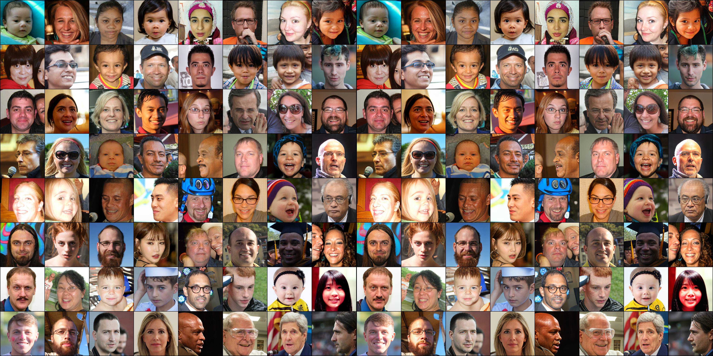
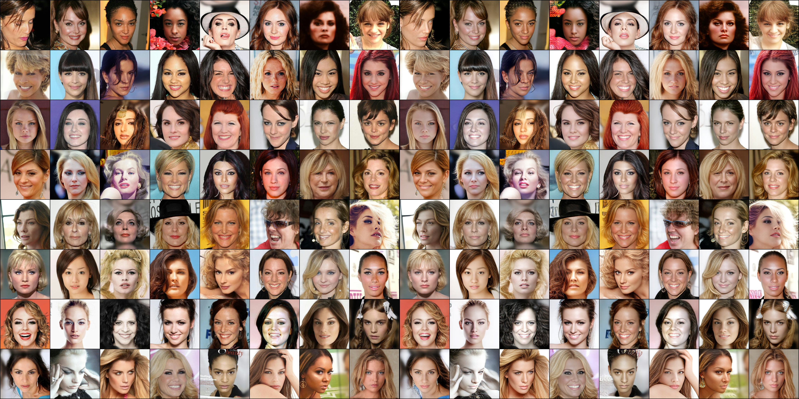

# LASER: Learnable Adaptive Structured Embedding Representation

LASER is a two-stage image model:

1. A DDPM-style autoencoder compresses an image through a sparse, learned
   dictionary using Orthogonal Matching Pursuit (OMP).
2. A transformer learns to generate the resulting atom/coefficient events.

The repository also retains a VQ-VAE baseline and generic Hydra entrypoints. The
experiments documented below use the current 256×256 RQ-VAE-compatible face path.

## FFHQ-256 Results

Stage-1 checkpoint:
[`ffhq-a2048-k2-rqvae-strict-20260720-145706`](https://wandb.ai/helloimlixin-rutgers/laser/runs/ffhq-a2048-k2-rqvae-strict-20260720-145706)

Full-dataset reconstruction FID: **3.371500** on all 70,000 FFHQ images.

rFID uses TorchMetrics' 2,048-dimensional Inception features and compares real
images with reconstructions from the frozen encoder, continuous OMP coefficients,
dictionary, and decoder. Images are converted to RGB, resized and center-cropped
to 256×256, then mapped to `[0, 1]` for the metric.

### Stage-1 Reconstruction

Both panels were produced from the same in-memory batch of the first 64 sorted
FFHQ images, so every cell has the same row and column in both grids. The right
panel is the direct Stage-1 reconstruction using continuous OMP coefficients; it
does not read from the token cache or quantize coefficients.



Originals are on the left; their direct Stage-1 reconstructions are in the same
positions on the right. The two 8×8 panels are stored in one image so README
rendering cannot change their relative size or vertical alignment.

Stage-2 run:
[`ffhq-a2048-k2-compound-v5b-official-rqtransformer-350M`](https://wandb.ai/helloimlixin-rutgers/laser/runs/ffhq-compound-rqt350-a2048k2-20260805)

## CelebA-HQ-256 Results

Stage-1 checkpoint:
[`celebahq-a2048-k2-rqvae-strict-20260720-145706`](https://wandb.ai/helloimlixin-rutgers/laser/runs/celebahq-a2048-k2-rqvae-strict-20260720-145706)

Full-dataset reconstruction FID: **9.851521** on all 30,000 CelebA-HQ
images (28,000 training and 2,000 validation images), using the same continuous
OMP reconstruction and TorchMetrics Inception protocol as FFHQ.

### Stage-1 Reconstruction

The two 8×8 panels were generated from one in-memory batch, with originals on
the left and their direct continuous-OMP Stage-1 reconstructions in the same
positions on the right.



## Model Design

Both reported checkpoints use the architecture below.

```text
image [B, 3, 256, 256]
  -> RQ-VAE/DDPM encoder
  -> quant_conv
  -> z_e [B, 8, 8, 256]
  -> per-site OMP, dictionary [256, 2048], k=2
  -> atom IDs and coefficients [B, 8, 8, 2]
  -> z_q[h,w] = c_1 d_{a_1} + c_2 d_{a_2}
  -> post_quant_conv
  -> RQ-VAE/DDPM decoder
  -> reconstruction [B, 3, 256, 256]
```

### Encoder and Decoder

The image backbone follows the original KakaoBrain RQ-VAE geometry.

| Component | Design |
| --- | --- |
| Input/output | RGB, 256×256 |
| Resolution levels | `[256, 128, 64, 32, 16, 8]` |
| Channel widths | `[128, 128, 256, 256, 512, 512]` |
| Encoder blocks | Two ResNet blocks per level |
| Decoder blocks | Three ResNet blocks per level |
| Attention | At 16×16 and in the 8×8 middle block |
| Latent | 8×8 spatial grid, 256 channels |

Each ResNet block uses GroupNorm, SiLU, two 3×3 convolutions, and a learned
shortcut when its width changes. The encoder downsamples with padded stride-2
convolutions. Its final GroupNorm/SiLU/3×3 projection and a 1×1 `quant_conv`
produce the dictionary-space latent.

The decoder applies a 1×1 `post_quant_conv`, a
`ResNet -> attention -> ResNet` middle at 8×8, and nearest-neighbor 2×
upsampling followed by 3×3 convolutions. A final GroupNorm/SiLU/3×3 projection
returns RGB.

### Dictionary-learning Bottleneck

The non-patch bottleneck codes each of the 64 latent sites independently against
a column-normalized dictionary
`D = [d_0, ..., d_2047] in R^(256×2048)`. OMP runs for exactly two steps:

1. Select the atom with maximum absolute correlation.
2. Remove its contribution and mask it from the next selection.
3. Select the strongest residual atom.
4. Jointly refit both coefficients through the selected 2×2 Gram system.

The sparse reconstruction is
`z_q = c_1 d_{a_1} + c_2 d_{a_2}`. A straight-through latent lets the decoder
receive `z_q` while the encoder receives an identity gradient. The checkpoint
uses first-batch dictionary initialization, commitment cost `0.25`, dictionary
learning rate `4e-5`, and dead-atom revival.

Stage 1 follows the FFHQ RQ-VAE loss recipe: pixel MSE, latent/dictionary loss
weighted by `0.25`, LPIPS weighted by `1.0`, and a two-layer hinge-loss
PatchGAN weighted by `0.75`. Training used Adam at `4e-5`, total batch size
128, and a five-epoch warmup.

## Token Cache

The full-dataset cache is produced by
[`build_official_imagenet_token_cache.py`](scripts/tools/build_official_imagenet_token_cache.py):

1. Recursively sort all 70,000 FFHQ image paths and apply the deterministic
   256×256 evaluation transform.
2. Encode every image with the frozen Stage-1 model and run k=2 OMP at every
   8×8 latent site.
3. Merge distributed shards back into dataset order.
4. Calibrate each OMP depth over the full dataset. The absolute maximum maps to
   the normalized limit 3, producing scales `[60.79166794, 14.69791698]`.
5. Save and validate the cache before Stage 2 starts.

| Key | Shape/type | Contents |
| --- | --- | --- |
| `atoms` | `[70000, 8, 8, 2]`, int16 | Two dictionary IDs per site |
| `coeffs` | `[70000, 8, 8, 2]`, float16 | Depth-normalized coefficients in `[-3, 3]` |
| `labels` | `[70000]`, int16 | Zero for unconditional FFHQ |
| `meta` | dictionary | Geometry, vocabularies, scales, transform, and checkpoint provenance |

The cache keeps continuous coefficients. During Stage-2 training, each is mapped
to a 1,024-way uniform distribution over `[-3, 3]`. One
`(atom_id, coefficient_bin)` pair is a compound event, giving
`8 * 8 * 2 = 128` events per image instead of 256 interleaved scalar positions.

## Stage-2 Prior

The compound prior retains the official unconditional FFHQ 350M RQ-Transformer
geometry:

| Setting | Value |
| --- | --- |
| Spatial body | Width 1,024; 24 layers; 16 heads |
| Within-site head | 4 layers; 16 heads |
| Compound depth | 2 events per site |
| Coefficient refinement | Two-layer pair-local micro-transformer |
| Coefficient classifiers | One head per OMP depth |
| Training | 200 epochs, effective batch 128 |
| Optimizer | AdamW, constant learning rate `5e-4` |

It factorizes each event as
`p(atom, coefficient | history) = p(atom | history) p(coefficient | history, atom)`.
The pair embedding combines the frozen atom vector, a learned coefficient
embedding, and their scaled physical contribution. Training uses atom NLL, soft
coefficient-bin cross-entropy, and a physical-geometry loss derived from the same
distributions used at sampling time.

## Installation

```bash
git clone https://github.com/helloimlixin/laser.git
cd laser
python -m venv venv
source venv/bin/activate
pip install -r requirements.txt
```

## Usage

Generic Hydra entrypoints:

```bash
# Train a sparse Stage-1 autoencoder.
python train.py stage1 model=laser data=celeba

# Train Stage 2 from an existing cache.
python train.py stage2 token_cache_path=/path/to/token_cache.pt

# Run a small end-to-end smoke test.
python scripts/tools/smoke_e2e.py
```

The FFHQ experiment is orchestrated by:

```bash
FFHQ_ROOT=/path/to/ffhq \
  bash scripts/run_ffhq_a2048_k2_compound_official_pipeline.sh
```

The launcher validates its Stage-1 reconstruction gate and the full 70,000-image
cache before resuming the official-settings Stage-2 run. Full-dataset rFID uses
[`evaluate_upstream_laser_rfid.py`](scripts/evaluate_upstream_laser_rfid.py).

## Code Map

| Path | Purpose |
| --- | --- |
| [`src/models/encoder.py`](src/models/encoder.py) | DDPM-style encoder and shared ResNet/attention blocks |
| [`src/models/decoder.py`](src/models/decoder.py) | Mirrored image decoder |
| [`src/models/dictionary_learner.py`](src/models/dictionary_learner.py) | Batched OMP dictionary bottleneck |
| [`src/models/laser.py`](src/models/laser.py) | Maintained Stage-1 Lightning model |
| [`src/models/rqvae/`](src/models/rqvae/) | RQ-VAE-compatible image backbone |
| [`cache.py`](cache.py) | Generic Stage-1 to Stage-2 cache entrypoint |
| [`scripts/train_official_rqtransformer_laser_stage2.py`](scripts/train_official_rqtransformer_laser_stage2.py) | Compound RQ-Transformer training and sampling |
| [`src/models/spatial_prior.py`](src/models/spatial_prior.py) | Generic spatial-depth sparse prior |
| [`src/models/mingpt_prior.py`](src/models/mingpt_prior.py) | Flat quantized GPT prior |

## Tests

```bash
pytest -q
```

Focused coverage is available under `tests/` for the encoder, decoder,
dictionary bottleneck, token-cache ordering, compound objective, and checkpoint
resume behavior.

## License

See [LICENSE](LICENSE).
