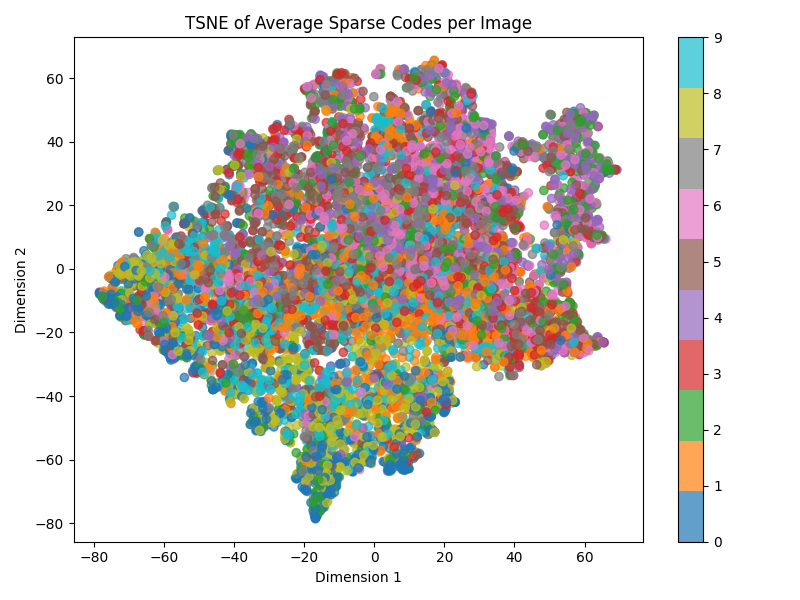
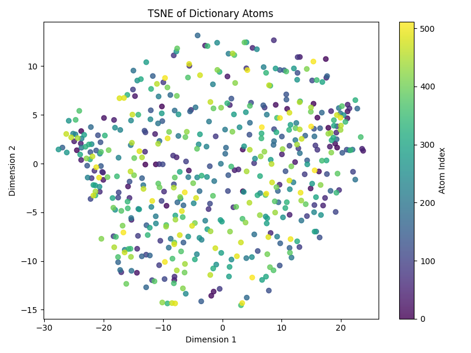
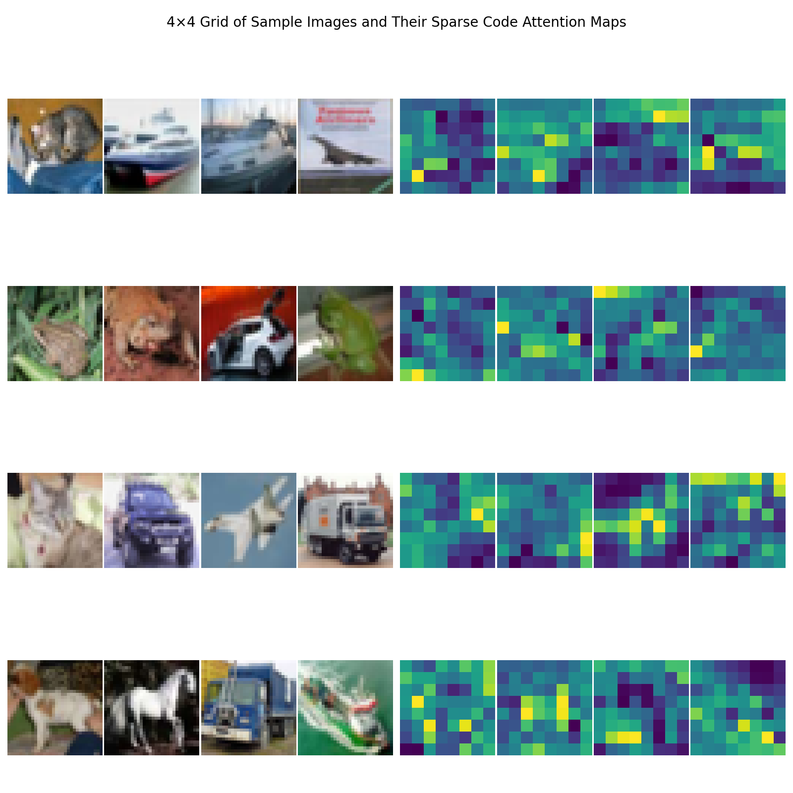
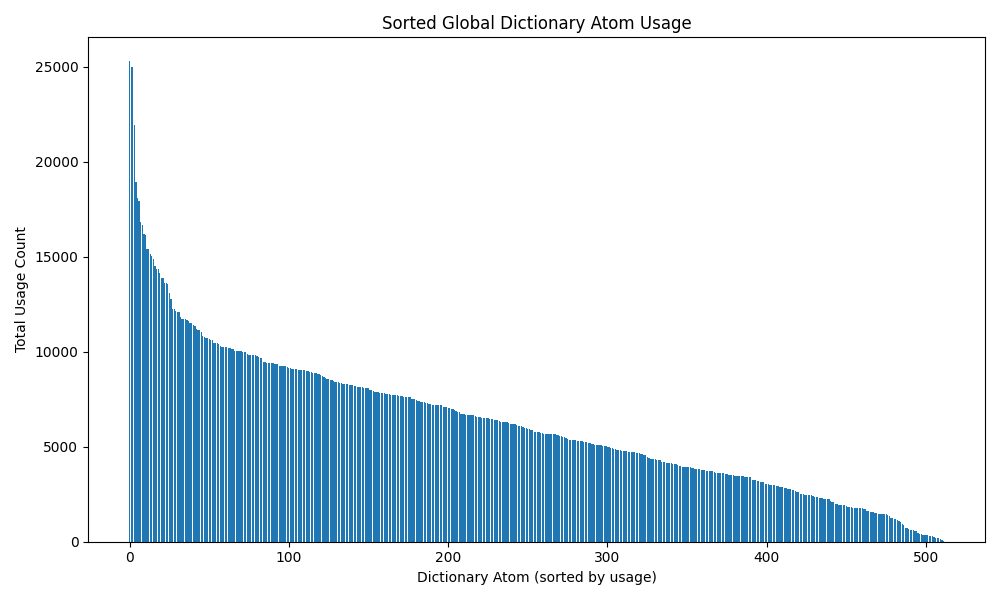
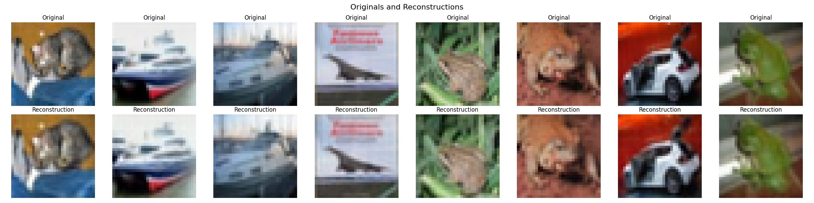
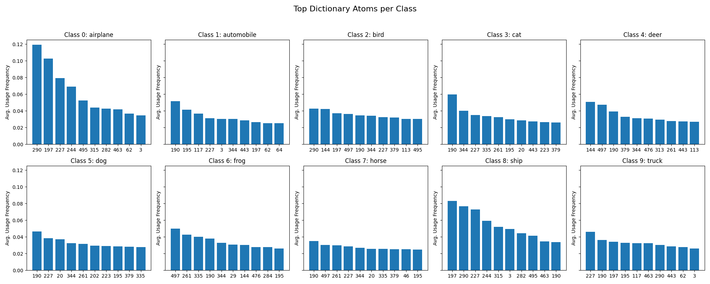

# Image Supplements for ICML 2025 Rebuttal

| Number of Latent Channels 	| PSNR    	| LPIPS    	| SSIM   	|
|---------------------------	|---------	|----------	|--------	|
| 16                        	| 29.3858 	| 0.004723 	| 0.9348 	|
| 32                        	| 29.6094 	| 0.004238 	| 0.9412 	|
| 64                        	| 30.8247 	| 0.003820 	| 0.9498 	|
| 128                       	| 33.5463 	| 0.003392 	| 0.9743 	|
| 256                       	| 33.7453 	| 0.003023 	| 0.9754 	|