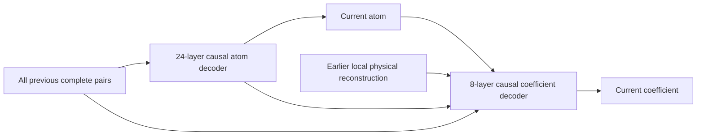

# Fresh compound training with full history in both decoders

Run: [church-laser-compound-raw-fullar-scratch300-h200x1-20260922](https://wandb.ai/helloimlixin-rutgers/laser/runs/church-laser-compound-raw-fullar-scratch300-h200x1-20260922).
Experiment directory: `outputs/church-compound-raw-fullar-scratch300-h200x1-20260922`.

Retired on September 23 for the user-authorized
[corrected fresh relaunch](church-compound-balanced-relaunch-2026-09-23.md).
The full epoch-26 / step-1,612 state and best epoch-24 state (FID 95.6076) were
preserved and verified online in selected-checkpoints artifact v50.

A subsequent [trained-checkpoint audit](church-full-history-conditioning-diagnosis-2026-09-22.md)
found that the coefficient head scarcely uses the current-atom input because
its embedding is overwhelmed by the much larger history activations. The
causal/caching checks below passed, but they did not establish effective learned
conditioning or competitive generation quality. The corrected successor starts
from random initialization with balanced coefficient inputs.

The user's final requirements are fresh stage-2 training, compound atom and
coefficient predictions, sufficient dedicated capacity for both fields, direct
access to the entire previous sparse-code history in both decoders, and no
coefficient clipping or normalization. The frozen selected stage-1 tokenizer
and original full-training compound cache are reused. No trained stage-2
checkpoint or preflight/benchmark weights initialize production.

## Factorization and model

There are 256 events, in raster spatial order followed by the four sparse depths.
Each event completes its atom and coefficient before advancing:

`product_t p(atom_t | pairs_<t) * p(coefficient_t | atom_t, pairs_<t)`.

Both decoders use a 256-position causal attention sequence. All completed pairs
remain individually available across spatial boundaries. Neither attention
history is pooled into spatial sums, restricted to the current depth stack,
truncated into chunks, or reset between sites.

| Component | Configuration | Parameters |
|---|---|---:|
| Atom decoder | 24 causal layers, width 1,024, 16 heads | 302,309,376 |
| Coefficient decoder | 8 causal layers, width 1,024, 16 heads | 100,769,792 |
| Atom classifier | 16,384 outcomes | 16,795,648 |
| Coefficient classifiers | Four depth-specific heads, each 2,048 outcomes | 8,404,992 |
| Entire model | Includes learned atom/coefficient embeddings and physical projections | 447,941,632 |

A completed pair's embedding includes a learned atom embedding, a learned
coefficient embedding, and a projection of its physical dictionary contribution.
The atom decoder receives these pair embeddings shifted by one event, with a
start token and positional embeddings. Its output conditions the coefficient
decoder together with the current atom, shifted completed pair, and strictly
earlier physical reconstruction at the current spatial site. Every coefficient
decoder layer also has causal attention over the complete sequence. The current
coefficient and future events cannot enter the current prediction.

This adapts the stacked conditional decoder design in
[DCTransformer, section 3.2](https://proceedings.mlr.press/v139/nash21a/nash21a.pdf).
That paper stacks channel, position and value decoders; later decoders receive
earlier predicted fields and partial-image context. Our spatial/depth positions
are fixed, so we predict atom then coefficient. All 256 events fit in attention;
the paper's long-sequence chunking and partial-DCT-image encoder are not used.
This is a LASER adaptation, not a DCTransformer reproduction or a claim of its
generation quality. The [supplement](https://proceedings.mlr.press/v139/nash21a/nash21a-supp.pdf)
also reports separate field likelihoods; this run monitors atom NLL and
coefficient KL separately on fixed training and validation probes.

## Coefficients and data

The 2,048 shared nonuniform coefficient centers remain in physical units.
All four depth scales equal one; `clamp_coeffs=False`. They span approximately
-20.29043 to 21.60837. This is finite scalar quantization, not lossless encoding
of arbitrary continuous OMP coefficients. There is no explicit coefficient clamp
or depth normalization. Gradient norm clipping and final decoded-image range
clamping are separate operations.

The cache contains all 126,227 Church training images and 16 stochastic OMP
support/coefficient variants per spatial site. A complete four-pair trajectory
is selected per site on each visit. Coefficient targets use physical-distance
soft probabilities at temperature 0.125, with freshly sampled coefficient
histories. The stage-1 tokenizer and coefficient book remain frozen. All source
assets and their recorded SHA-256 hashes are checked before training.

The complete cache was built before launch and stays resident in host RAM.
Training performs no image loading, encoder inference, or OMP solving. Raw
coefficients remain FP32; stochastic variant selection and coefficient targets
are computed on GPU. The cache SHA-256 is
`437bf76107dd3da5661db6c766b474be43304f37705d6c8431f2e34ae3afa9fa`.

## Training, selection and recovery

The target is 300 epochs / 18,600 optimizer updates. A single H200 uses eight
microbatches of up to 256 images per update for exact global batch 2,048.
The final batch contains 1,299 images; every training image appears once per
epoch with no duplication or dropping. AdamW uses LR 0.0005, betas (0.9, 0.95),
weight decay 0.0001, cosine decay to zero, no warmup, residual dropout 0.1,
and gradient norm limit 1. Atom/coefficient objective weights are 1.5/1.0.
The optimizer and schedule retain the earlier comparison recipe.

Official RQ FID50k runs after every epoch against the same complete training
reference. Sampling uses atom temperature 1 / top-k 250, coefficient temperature
1 / all bins, and top-p 1 for both. All positions are sampled sequentially;
parallel teacher forcing during training does not change the factorization.
The first 64 generated images are logged without selection. The 300-image
training probe and separate 300-image validation set monitor each head by depth.

Full latest checkpoints are saved before evaluation, with an explicit pending
evaluation phase. A restart at that phase evaluates the saved model without
retraining that epoch. After FID, full latest and best-FID checkpoints include
model, AdamW, cosine scheduler and Python/NumPy/CPU/CUDA RNG states. The async
uploader verifies committed online artifact digests and sizes. A detached
supervisor and monitor provide bounded crash/stall recovery; completion requires
the final epoch and final checkpoint upload to be verified.

## Verification before launch

Seven focused tests passed, covering causality, direct history across sites,
current-atom conditioning, both heads' gradient flow, cache ordering, raw signed
values, and dense/cached agreement through all 256 events.

The production-size GPU preflight found zero current/future leakage at tested
events 0, 1, 3, 4, 127 and 255. Swapping two early complete pairs while preserving
their spatial contribution sum changed both final predictions, confirming the
individual-event history path. Dense/cached maximum logit differences were
5.96e-6 (atom) and 4.29e-6 (coefficient) in FP32, and 0.03125 in BF16; maximum
BF16 distribution KL was 2.04e-5. Both full decoders and all classifiers had
finite, nonzero gradients and updated parameters in disposable optimizer trials.

An eight-image codec check measured additional latent MSE 1.80214e-7 from hard
nearest-center quantization versus the cached continuous coefficients. This is
a bounded codec check, not a measurement of stochastic target noise or FID.
A complete 2,048-image generation batch completed
with 67.5 GiB peak allocated GPU memory. Training microbatches 64, 128 and 256
were measured; 256 was fastest at approximately 473 images/second and 97.1 GiB
peak allocated memory. These are preflight throughput measurements.

Implementation: [model](../src/models/compound_full_history.py),
[tests](../tests/test_compound_full_history.py). Full execution sources,
preflight evidence, training plan and benchmark results are snapshotted under
the experiment directory and published with the run's source artifact.

The previous integer run stopped at epoch 54 / step 3,348. Its latest state and
best epoch-36 state (FID 11.8709) were verified online in selected-checkpoints
artifact v35 before the GPU was reassigned. Those results are not results of
this new compound architecture.

## First production epoch

Epoch 1 completed all 62 updates and the full FID50k evaluation: FID 166.9675.
This is the new model's initial baseline, not a mature generation result.
Fixed-probe atom NLL was 9.51295 on training images and 9.51392 on validation;
coefficient KL was 1.96387 and 1.98016, respectively. The first full checkpoint
was checked for all 447,941,632 parameters, AdamW/scheduler step 62, and complete
RNG states. Training continues toward 300 epochs under the detached supervisor
and monitor.

Epoch 2 completed its full FID50k evaluation at step 124 with FID 132.5554.
The epoch-1 evaluated latest and best checkpoints were committed online in
selected-checkpoints artifact v1. An independent API check verified both remote
file sizes and digests against the local upload receipt and downloaded selection
manifest. Subsequent checkpoint uploads continue asynchronously during training.
