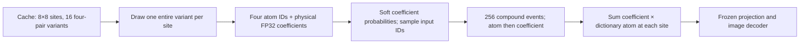

I audited the **frozen runtime and physical-coefficient cache actually used by
the active Church run**, including its immutable epoch-60 model. The pairing,
unit conversion, and autoregressive conditioning checks passed. The strongest
concerns are the coefficient target distribution and the depth-independent
sampling cutoff. These are modeling choices worth testing; this audit does
not establish what caused the observed FID regression.

The path is:

1. **Soft coefficient sampling dominates ordinary quantization error.**
   The active [coefficient target implementation](../outputs/church-stochastic-rawcoeff90-20260921/runtime/src/training/rqtransformer.py#L868)
   computes `q(j|c) ∝ exp(-(c-bin[j])²/0.125)`, samples an input coefficient
   ID from q, and trains against the full q. It does not merely use the nearest
   bin. Consequently even a perfect prior learns a distribution of noisy
   coefficients. This is a consistent generative objective, but differs from
   the nearest-quantized sparse-code distribution used in hard-code fidelity
   checks. These independently perturbed coefficients also cease to be the
   exact least-squares solution for their selected support.

   A seeded probe of 128 training images / 8192 spatial sites measured:

   | Coefficient policy | Added latent MSE versus continuous coefficients | Coefficient noise RMS |
   |---|---:|---:|
   | Nearest physical bin | 1.8061e-7 | Approximately 0.0025–0.0050 by depth |
   | Current soft target, τ=0.125 | 9.6516e-4 | 0.245–0.250 |
   | Same bins, τ=0.03125 | 2.4338e-4 | 0.124–0.125 |
   | Same bins, τ=0.0078125 | 6.0991e-5 | Approximately 0.0625 |

   The current soft target adds **5344×** the nearest-bin latent error on
   this probe. The ratio is large because hard quantization is already very
   accurate; the soft error is approximately 0.31% of the probe's latent
   signal mean square. This is added representation distortion, not model
   prediction error or FID. On four fixed images, using the actual frozen
   decoder and identical supports, image MSE versus continuous-coefficient
   decoding was 3.3171e-7 for nearest bins, 0.002014 for τ=0.125, and
   0.0005228 for τ=0.03125, with pixels in [-1,1]. The image probe uses one
   coefficient draw per image and is not a reconstruction-FID experiment.

2. **Nonuniform bins change the meaning of the soft target.**
   Lloyd–Max centers are nonuniform, but the softmax treats every center as
   having equal base mass. Thus it weights physical regions according to
   their center density; it is not a Gaussian integrated over quantization
   cells. On the same probe, RMS displacement of the target mean from the
   true coefficient was 0.0080, 0.0081, 0.0131, and **0.0293** across depths.
   Integrating Gaussian probability over nearest-neighbor cells reduced that
   bias to at most 0.000114 in this probe, while retaining approximately
   0.000977 latent MSE from the noise itself. Correcting the base measure and
   reducing temperature therefore address different effects. The cache's
   own metadata already identifies cell-integrated targets as a separate
   objective and recommends recalibrating temperature for the new bins.
   This is not an accidental physical-unit scaling error.

3. **Top-k=250 truncates the later atom distributions much more strongly.**
   I loaded the actual epoch-60 weights and measured 16 training images /
   1024 sites under FP32 CPU teacher forcing with stochastic coefficient
   histories. [Generation](../outputs/church-stochastic-rawcoeff90-20260921/runtime/src/training/rqtransformer.py#L2656)
   uses the same top-k at all four depths:

   | Depth, starting at 1 | Probability mass retained by top-250 | Target atoms outside top-250 |
   |---|---:|---:|
   | 1 | 99.14% | 0.78% |
   | 2 | 86.26% | 9.28% |
   | 3 | 63.15% | 25.88% |
   | 4 | **32.41%** | **60.64%** |

   This is substantial truncation at depth 4. It may help by suppressing
   unreliable tails, or hurt by suppressing legitimate residual supports;
   teacher-forced statistics cannot determine which improves generated FID.
   A depth-specific sampling sweep is justified. These numbers are a small
   training-set probe, not measurements on generated histories.

4. **The sixteen cached variants are not sixteen distinct supports.**
   On the 1024-site probe, there were **5.10 distinct ordered supports per
   site on average**, with mean empirical support entropy 1.070 nats.
   Independent bank draws differed in support with probability 48.92%.
   With 60 independent visits, the expected fraction of the sixteen variant
   indices already seen is `1-(15/16)^60 = 97.92%`. This does not mean all
   possible image-level combinations have been exhausted, and coefficient
   sampling still supplies additional randomness. It does mean the atomic
   support augmentation is a finite, repeatedly visited bank. Repeated
   supports legitimately encode their empirical sampling weight; uniformly
   deduplicating them would change the target distribution.

The implementation checks support the following conclusions:

- [OMP](../outputs/church-stochastic-rawcoeff90-20260921/runtime/src/stochastic_compound.py#L18)
  selects distinct atoms and refits all four coefficients together. Its
  least-squares tests pass. The sampled active supports had no duplicate IDs;
  their Gram-matrix condition numbers were modest (median 1.93, p99 3.21).
- [Variant selection](../outputs/church-stochastic-rawcoeff90-20260921/runtime/src/stochastic_compound.py#L74)
  gathers atoms and coefficients with the identical site-level index across
  the complete depth axis. There is no independent atom/coefficient-bank draw.
- Coefficients are FP32 physical least-squares values; all four scales are one.
  The same frozen, unit-normalized dictionary and exact bin centers are used
  for pair embeddings and decoding. The existing physical-cache integration
  checks also verify continuous-latent preservation against the source cache.
- [Full-pair conditioning](../outputs/church-stochastic-rawcoeff90-20260921/runtime/src/training/rqtransformer.py#L2431)
  implements `p(a_d|past pairs) p(c_d|past pairs,a_d)`. Earlier final-fit
  coefficients are legitimate earlier random variables in this factorization.
  Their dependence on the eventual full support is not, by itself, future
  target leakage. The current/future coefficient IDs do not affect current
  predictions; the coefficient head sees the current atom as intended.
- Eleven frozen-runtime tests passed. The six autoregressive tests also
  passed with the active short-attention override installed. An additional
  four-site/four-depth probe compared all 16 cached events with parallel
  teacher forcing; maximum absolute logit error was 2.38e-7 for both heads.
- Each sparse depth receives equal weight within atom CE and coefficient CE.
  On the 8192-site probe, individual pair energies were distributed 67.3%,
  20.4%, 8.7%, and 3.6% across depth. These are shares of summed individual
  pair energies, not additive explained-variance fractions, because atoms
  are not orthogonal. Equal likelihood weighting is valid, but need not
  coincide with a perceptual-quality objective.

The next controlled tests should separate these effects: first compare lower
coefficient target temperatures with the same physical codebook and supports;
independently test cell-integrated targets; and evaluate depth-specific atom
sampling cutoffs on a fixed checkpoint. Smaller target noise reduces the
measured representation distortion, but may also reduce useful regularization.
Generated FID must decide which choices help. A vocabulary replacement is not
needed for these tests. The active continuation's objective and sampler were
left as configured during this read-only audit.

Reproducible CPU probes and machine-readable results are under
[outputs/church-sparse-code-audit-20260921](../outputs/church-sparse-code-audit-20260921/):
`audit_targets.py`, `target-audit.json`, `audit_model.py`, `model-audit.json`,
`audit_decoder.py`, `decoder-audit.json`, and `cached-forward-audit.json`.

Training continues in the original online run with FID50k every epoch.
At epoch 63 the adaptive controller made its first reduction, from 2.9290e-5
to 1.5145e-5. The preserved best is epoch 60, FID50k 10.68846321. The full
resumed epoch-61 latest state and full epoch-60 best state were verified in
committed W&B `selected-checkpoints:v13`; subsequent working states are
uploaded asynchronously with bounded storage. Current scores and committed
uploads are in the continuation's live receipts.
